### H5移动web

### **[1、简述弹性盒子flex布局及rem布局](https://www.cnblogs.com/qcloud1001/p/9848619.html)**

- **flex布局方式**
  - 采用flex布局的元素,成为flex为容器,所有的子元素,都包含在容器内,容器存在两个默认的轴
    - 水平主轴
      - 主轴的开始位置(与边框的交叉点)叫做`main start`结束位置叫做`main end`
    - 垂直交叉轴
      - 交叉轴的起始位置叫做`cross start`结束位置叫做`cross end`
  - 常用属性
    - **flex-direction(决定主轴的排列方向)**
      - `row`（默认值）：主轴为水平方向，起点在左端。
      - `row-reverse`：主轴为水平方向，起点在右端。
      - `column`：主轴为垂直方向，起点在上沿。
      - `column-reverse`：主轴为垂直方向，起点在下沿。
    - **flex-wrap(默认都在一行显示,该属性课实现换行排列)**
      - `nowrap`(默认值): 不换行
      - `wrap`：换行，第一行在上方
      - `wrap-reverse`：换行，第一行在下方
    - **flex-flow**
      - `flex-flow`属性是`flex-direction`属性和`flex-wrap`属性的简写形式，默认值为`row nowrap`。
    - **justify-content(定义了项目在主轴上的对齐方式)**
      - `flex-start`（默认值）：左对齐
      - `flex-end`：右对齐
      - `center`： 居中
      - `space-between`：两端对齐，项目之间的间隔都相等。
      - `space-around`：每个项目两侧的间隔相等。所以，项目之间的间隔比项目与边框的间隔大一倍。
    - **align-items(定义项目在交叉轴上如何对齐)**
      - `flex-start`：交叉轴的起点对齐。
      - `flex-end`：交叉轴的终点对齐。
      - `center`：交叉轴的中点对齐。
      - `baseline`: 项目的第一行文字的基线对齐。
      - `stretch`（默认值）：如果项目未设置高度或设为auto，将占满整个容器的高度。
    - **align-content(定义了多根轴线的对齐方式。如果项目只有一根轴线，该属性不起作用)**
      - `flex-start`：与交叉轴的起点对齐。
      - `flex-end`：与交叉轴的终点对齐。
      - `center`：与交叉轴的中点对齐。
      - `space-between`：与交叉轴两端对齐，轴线之间的间隔平均分布
      - `space-around`：每根轴线两侧的间隔都相等，所以，轴线之间的间隔比轴线与边框的间隔大一倍
      - `stretch`（默认值）：轴线占满整个交叉轴
- **rem布局方式**
  - **rem是什么?**
    - rem（font size of the root element）是指相对于根元素的字体大小的单位，简单的说它就是一个相对单位,看到rem大家一定会想起em单位，em（font size of the element）是指相对于父元素的字体大小的单位,它们之间其实很相似，只不过rem计算的规则是依赖根元素,em是依赖父元素计算
  - **rem布局**
    - 原理是，先按定高宽设计出来页面，然后转换为rem单位，配合js查询屏幕大小来改变html的font-size，最终做出所谓的完美自适应
  - **rem使用场景**
    - rem+js是宽度自适应，无法做到高度自适应，所以那些对高度要求很高的rem+js无法实现,改变浏览器宽度，你会发现，页面所有元素的高宽都等比例缩放，也就是大屏幕下导航是横的，小屏幕下还是横的只不过变小了
    - 优点：理想状态是所有屏幕的高宽比和最初的设计高宽比一样，或者相差不多，完美适应
    - 缺点：碰到重视高度的设计，或者重视元素间间距的设计，那就玩不开了

### **2、如何最小化重绘(repaint)和回流(reflow)（拓展需要掌握）**

- DOM的增删行为

  - 比如要给某个父元素添加子元素时,这类的操作都可以引起回流,如何添加多个子元素的时候,可以使用documentfragment

- 几何属性的变化

  - 比如元素宽高发生了变化,border,字体大小发生了变化,这种直接会引起页面布局变化的操作也会引起回流。如果你要改变多个属性，最好将这些属性定义在一个class中，直接修改class名，这样只用引起一次回流

- 元素的位置变化

  - 修改一个元素的左右margin，padding之类的操作，所以在做元素位移的动画，不要更改margin之类的属性，使用定位脱离文档流后改变位置会更好

- 获取元素的偏移量属性

  - 例如获取一个元素的scrollTop、scrollLeft、scrollWidth、offsetTop、offsetLeft、offsetWidth、offsetHeight之类的属性，浏览器为了保证值的正确也会回流取得最新的值，所以如果你要多次操作，最好取完做个缓存

- 避免同步布局事件

  - 当我们访问元素的一些属性的时候，会导致浏览器强制清空队列，进行强制同步布局。举个例子，比如说我们想将一个p标签数组的宽度赋值为一个元素的宽度，我们可能写出这样的代码：

    ```js
    function initP() {
        for (let i = 0; i < paragraphs.length; i++) {
            paragraphs[i].style.width = box.offsetWidth + 'px';
        }
    }
    ```

  - 这段代码看着没有什么问题,但是可能会造成很大的性能问题,在每次循环的时候,都触发了p标签的width属性,这就导致了一个问题,就是在每次循环的时候,浏览器必须使用上次循环中生效的样式更新操作,才能响应本次循环读取的样式操作,每次循环就导致强制浏览器刷新队列机制,可以优化为:

    ```js
    const width = box.offsetWidth;
    function initP() {
        for (let i = 0; i < paragraphs.length; i++) {
            paragraphs[i].style.width = width + 'px';
        }
    }
    ```

### **3、对viewport理解**

- **核心定义**

  - 移动设备上的viewport就是设备的屏幕上能用来显示我们的网页的那一块区域，在具体一点，就是浏览器上(也可能是一个app中的webview)用来显示网页的那部分区域，但viewport又不局限于浏览器可视区域的大小，它可能比浏览器的可视区域要大，也可能比浏览器的可视区域要小。在默认情况下，一般来讲，移动设备上的viewport都是要大于浏览器可视区域的，这是因为考虑到移动设备的分辨率相对于桌面电脑来说都比较小，所以为了能在移动设备上正常显示那些传统的为桌面浏览器设计的网站，移动设备上的浏览器都会把自己默认的viewport设为980px或1024px（也可能是其它值，这个是由设备自己决定的），但带来的后果就是浏览器会出现横向滚动条，因为浏览器可视区域的宽度是比这个默认的viewport的宽度要小

- **meta标签**

  - 通过设置meta标签,可以设置viewport

    ```html
    <meta name="viewport" content="width=device-width, initial-scale=1.0, maximum-scale=1.0, user-scalable=0">
    ```

- **常用属性**

  ​	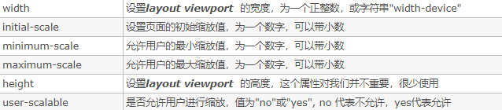

### **4、对二倍图、三倍图的理解和使用**

- **逻辑像素**

  - 就是程序概念的,横向或者纵向的(css px)像素点

- **物理像素**

  - 物理设备屏幕横向或者纵向提供的荧光点的像素点
  - 在一个设备某个区域内想要显示清晰的条件要素是,设置的`逻辑横向像素点`,`需要刚好填满物理设备提供的物理像素荧光点`

- **概述**

  - 在早起的屏幕分辨率(物理像素)基本上(iphone3)都是320px(320物理像素点),那个时候1pxcss== 1px物理像素
  - 由于现在设备不同设备分辨率(物理像素)越来越高,苹果公司退出了,视网膜屏幕,那这种屏幕设备物理又提升了好几倍,这个时候1pxcss单位已经占不满屏幕的物理像素px了
  - 如何选择多大的css图片? 就是最早期的IPhone 3的横向物理像素320为基础值与该设备的物理像素（屏幕分辨率：一般买手机会有说明）的比值就是你该选用UI设计给的1倍 ，2倍 ,3倍 ,4倍 等图了,比值是1就用1倍， 2就用2倍 依次类推 ),比值可以通过BOM的window对象点devicePixelRatio属性获取到,当前屏幕设备要用多大的倍图

- **图解倍图**

  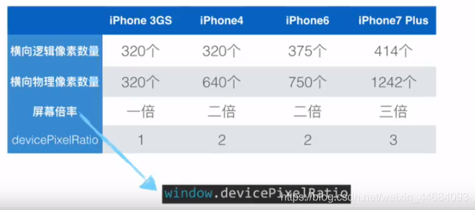

- **为什么要有2倍图,3倍图?**

  ​		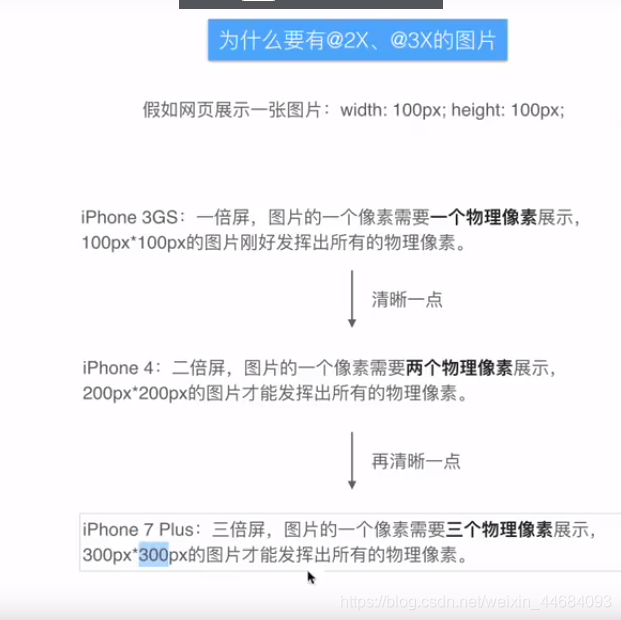

- **详细解释**

  ​		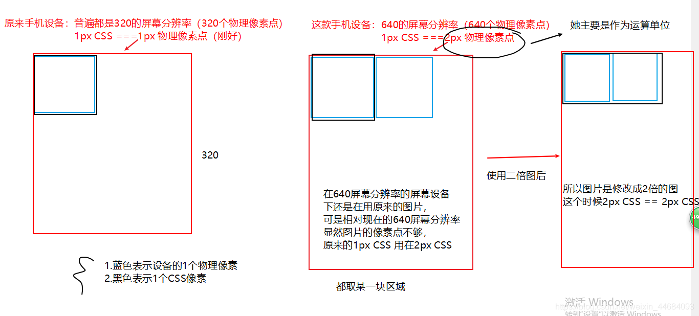

- **使用方式**

  ```css
@mixin bg-image($url) {
      background-image: url($url + "@2x.png");
      @media (-webkit-min-device-pixel-ratio:3),(min-device-pixel-ratio:3){
        background-image: url($url + "@3x.png")
      }
    }
  ```

### **5、在移动端中如何绘制0.5px像素** 

- **基本定义**

  ​		设计师在做设计图的时候都是以iphone6（宽为750物理像素）为基准进行设计的。iphone6的设备像素比（即css像素与物理像素的比例）是2，所以设计师在设计图画了边框为1px的box的时候，相对于css代码来说就是0.5像素。如果用css直接设置边框为0.5px，这种情况下iPhone可以正常显示，但是android下几乎所有的浏览器都会把0.5识别为0，即无边框状态，所以这种方式行不通的

- **代码实现**

  ```html
  <!DOCTYPE html>
  <html>
  <head>
   <meta charset="utf-8">
   <title>0.5px线实现方法</title>
   <style type="text/css">
   /*标准1px边框*/
   .b1{
   height: 40px;
   border: 1px solid #ff0000;
   }
   /*1.可以利用利用渐变样式=>实现.5px*/
   .a1{
   height: 1px;
   margin-top: 20px;
   background-image: linear-gradient(0deg, #f00 50%, transparent 50%);
   }
   /*2.可以利用缩放-发虚=>实现.5px*/
   .a2{
   height: 1px;
   margin-top: 20px;
   background-color: #f00;
   -webkit-transform: scaleY(.5);
   transform:scaleY(.5);
   }
   /*3.四条边框都需要的样式*/
   .scale-half {
   margin-top: 20px;
   height: 100px;
   border:1px solid #f00;
   -webkit-transform-origin: 0 0;
   transform-origin: 0 0;
   -webkit-transform: scale(.5, .5);
   transform: scale(.5, .5);
   }
   /*4.给伪元素添加设置边框*/
   .border3{
   position: relative;
   }
   .border3:before{
   content: '';
   position: absolute;
   width: 200%;
   height: 200%;
   border: 1px solid blue;
   -webkit-transform-origin: 0 0;
   -moz-transform-origin: 0 0;
   -ms-transform-origin: 0 0;
   -o-transform-origin: 0 0;
   transform-origin: 0 0;
   -webkit-transform: scale(.5, .5);
   -ms-transform: scale(.5, .5);
   -o-transform: scale(.5, .5);
   transform: scale(.5, .5);
   -webkit-box-sizing: border-box;
   -moz-box-sizing: border-box;
   box-sizing: border-box;
   }
   </style>
  </head>
  <body>
  <div class="b1">正常1px边框</div>
  <div class="a1"></div>
  <div class="a2"></div>
  <div class="scale-half"></div>
  <div class="border3">
   <div class="content">伪类设置的边框</div>
  </div>
  </body>
  </html>
  ```


## js基础

### **1、JavaScript 内置的常用对象有哪些？并列举该对象常用的方法**

- **Math(数学对象)**
  - abs(返回绝对值)
  - ceil(向上取整)
  - floor(向下舍入)
  - max(最大值)
  - min(最小值)
  - rendom(返回0~1之间的随机数)
- **Date(日期对象)**
  - Date(返回当前日期)
  - getDate(返回一个月中的某一天)
  - getMonth(返回对象中的月份)
  - getHours(返回对象中的小时)
  - getMinutes(返回对象中的分钟)
- **String(字符串对象)**
  - concat(链接字符串)
  - trim(去除字符串两侧留白)
  - indexOf(检索字符串索引)
  - replace(替换与正则匹配的字符串)
  - split(把字符串切割为数组)
- **Array(数组对象)**
  - pop(末尾删除)
  - push(末尾添加)
  - shift(删除数组第一个元素)
  - unshifr(添加到数组中第一的位置)
  - sort(对数组进行排序)
  - reverse(翻转数组)

### **2、如何区分数组和对象**

- **区分数组**
  - Array.prototype.isPrototypeOf()
    - 通过原型的方式,判断Array是否存在于Object的原型中
  - isArray()
    - 该方法可以判断,返回的是一个布尔值
- **区分对象**
  - Object.prototype.toString.call()
    - 因为toString为Object的原型方法,而Array和Function等类型作为Object的实例,都重写了该方法,不同的对象类型调用时,调用的是重写之后的toString()方法,所以不能得到其对象类型,只能把Obj转换为字符串类型

### **3、JavaScript 中的作用域、预解析与变量声明提升?**

- **作用域**

  - 全局作用域`在函数外部的区域,都可以称之为全局作用域`
  - 局部作用域`在函数内部的区域,都可以称之为局部作用域`
  - 块级作用域`es6中新增了块级作用域,把{}都可以视为块级作用域`

- **预解析**

  - 该机制是javaScript中存在的一种机制,会把函数声明,和使用Var声明的变量,进行提升

- **变量声明提升**

  - 只要使用了var声明,就会存在变量声明提升的问题

  ```js
  console.log(num)// undefined
    var num = 20;
    // 解析为:
    var num;
    console.log(num) // 声明了变量,但是未赋值,undefined
    num = 20
     *********************************分割线*******************************************
        // 函数表达式中,使用了var关键字,会报错
    	fn() // TypeError: fn is not a function
        var fn = function(){
          console.log('啊~我提升了')
        }
        // 解析为
        var fn
        fn()
        fn =function (){
          console.log('啊~我提升了')
        }
  ```

  - 函数声明也会被预解析机制影响,导致函数声明提升`函数虽然提前调用,但是不会报错,印证了函数声明存在预解析`

  ```js
       fn() // 输出: 预解析中的函数声明
        function fn() {
          return console.log('预解析中的函数声明')
        }
        // 解析为:
        function fn() {
          return console.log('预解析中的函数声明')
        }
        fn()
  ```

  - 函数名重复的情况下`如果两个名称相同,会保留后者`

  ```js
  // 两个函数名称相同,那么会输出最后函数的结果
    fn()
  function fn() {
          return console.log('我是fn函数A')
  }
    fn()
   function fn() {
          return console.log('我是fn函数B')
   }
  // 输出: 两个: 我是fn函数B
  
  //解析为:
    function fn() {
          return console.log('我是fn函数A')
        }
    function fn() {
          return console.log('我是fn函数B')
    }
   fn()
   fn()
  ```

  - 函数名和变量名重复:`只会对函数进行提升,变量忽略,并且不会发生调用`

  ```js
   console.log(fnc) // 输出函数体: fucntion fn () { console.log('我是函数') }
        function fnc() {
          return console.log('我是函数')
        }
        var fnc = '我是一个字符串'
        // 解析为:
        function fnc(){}
        console.log(fnc)
        fnc = '我是一个字符串'
        //总结: 只会对函数进行提升,变量会被忽略,并且不会发生调用
  ```

### **4、如何实现数组的随机排序**

- **使用sort()结合Math.random()**

   ```js
    var arr = [1,2,3,4,5,6,7,8,9,10];
           arr.sort(function () {
            return Math.random()-0.5
           })
           console.log(arr)
   ```

- **循环过程中通过Math.random()函数产生的随机值，在数组中这个随机值位置的数和arr[i]位置的数据交换，循环结束，产生随机数组**

   ```js
    var arr = [1,2,3,4,5,6,7,8,9,10];
    function randSort1(arr) {
        for(var i = 0, len = arr.length; i < len; i++) {
            var rand = parseInt(Math.random() * len);
            var temp = arr[rand];
            arr[rand] = arr[i];
            arr[i] = temp;
        }
        return arr;
    }
    
    console.log(randSort1(arr))
   ```

### **5、说一下数组的常用方法有哪些?**

- psuh()末尾追加
- pop()末尾删除
- sort()数组排序
- reverse()翻转数组
- shift()头部删除
- unshift()头部添加
- forEach()循环
- filter()过滤
- reduce()计算总和

### **6、Let、Const、Var三者区别？（解决了什么问题）**

- **区别如下**
  - 变量提升
    - var声明的变量都会存在变量提升问题,但是let和const不会
  - 重复声明
    - 使用var声明的变量,可以重复声明
    - let和const不能重复声明
  - 作用域
    - let/const都会产生块级作用域,var声明的变量则不会发生
  - 赋值操作
    - var声明的变量,可以先声明,在去赋值,如果未赋值,出现undefined
    - let声明的变量,可以进行改变,类型和值都可以改变
    - const声明的变量,不可以进行改变,一旦进行改变,就必须立即初始化,不能留到以后赋值
  - 其它
    - conts/let声明的变量,都会存在暂时性死区的问题
    - const保存的仅是对象的指针,const仅会保证指针不会发生改变,所以,当修改一个对象的属性,并不会改变对象的指针,也就是说,const定义的引用类型,只要指针不发生变化,其它的改变的都是允许的

### [**7、JS中eventLoop的循环机制？ (面试常问)**](https://zhuanlan.zhihu.com/p/55511602)

- **堆(Heep)**

  - 堆是一种数据结构,是利用二叉树维护的一组数据,堆分为两种,一种为最大堆,一种为最小堆,将根节点最大的堆称之为最大堆或大根堆,根节点最小的堆,叫做最小堆或者小根堆,堆是线性数据结构,相当于一维数组,有唯一后继

    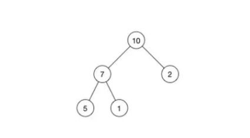

- **栈(Stack)**

  - 栈,是在计算机科学中限定仅在表尾进行插入,或者是删除操作的线性表,栈是一种数据结构,它按照后进先出的原则存储数据,`先进入的数据压入栈底`,`最后的数据在栈顶`,需要读数据的时候,从栈顶开始弹出数据,栈是只能在某一端插入和删除的特殊线性表

    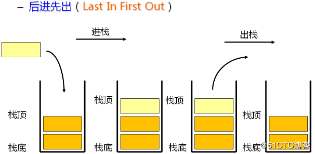

- **队列(Queue)**

  - 队列,其特殊之处在于,只允许在表的前端(front)进行删除操作,而在表尾(rear)进行插入操作,和堆栈一样,是一种受限的线性表,进行插入操作的端,叫做队尾,进行删除操作的端,叫做队头,队列中不存在元素时,称之为空队列

  - 队列的数据元素,称之为队列元素,在队列中`插入一个队列元素,称之为入队,`从`队列中删除一个元素,称之为出队,`因为**队列只允许在一端插入,在另外一端删除**,所以只有最早进入队列的元素,才能从队列中删除,故队列称之为`先进先出`

    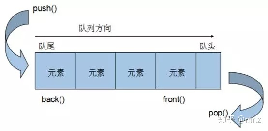

- **宏任务(MacroTask)**

  - `script`全部代码、`setTimeout`、`setInterval`、`setImmediate`（浏览器暂时不支持，只有IE10支持，具体可见`MDN`）、`I/O`、`UI Rendering`

- **微任务(MicroTask)**

  - `Process.nextTick（Node独有）`、`Promise`、`Object.observe(废弃)`、`MutationObserver`

- **浏览器中的EventLoop**

  - `Javascript` 有一个 `main thread` 主线程和 `call-stack` 调用栈(执行栈)，所有的任务都会被放到调用栈等待主线程执行

- **js调用栈**

  - JS调用栈采用的是`后进先出`的规则，当函数执行的时候，会被添加到栈的顶部，当执行栈执行完成后，就会从栈顶移出，直到栈内被清空

- **同步任务和异步任务**

  - `Javascript`单线程任务被分为**同步任务**和**异步任务**，同步任务会在调用栈中按照顺序等待主线程依次执行，异步任务会在异步任务有了结果后，将注册的回调函数放入任务队列中等待主线程空闲的时候（调用栈被清空），被读取到栈内等待主线程的执行

    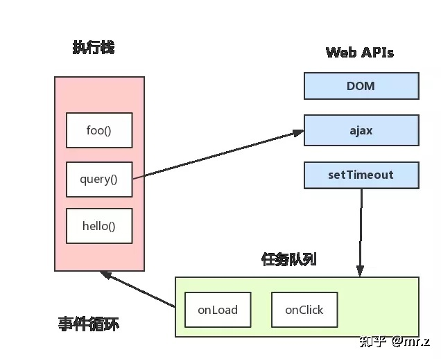

  - 任务队列`Task Queue`，即队列，是一种先进先出的一种数据结构

    

    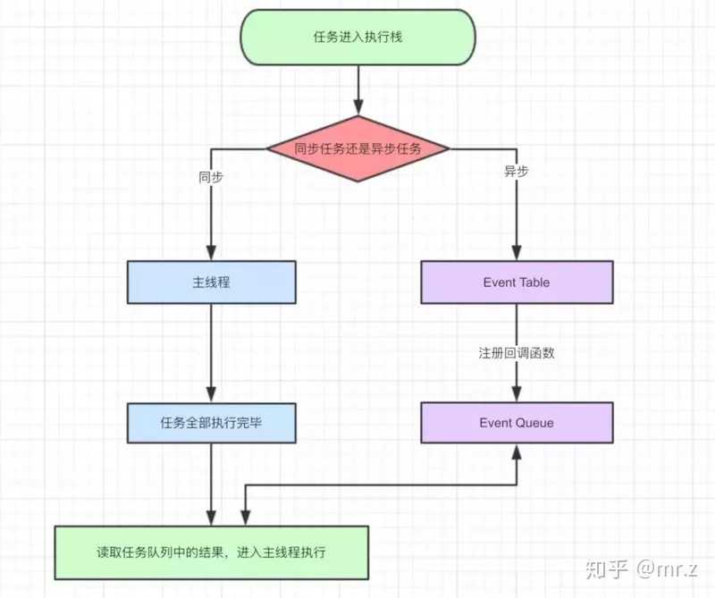

  - **事件循环的事件模型**

    - 选择当前要执行的任务队列，选择任务队列中最先进入的任务，如果任务队列为空即`null`，则执行跳转到微任务（`MicroTask`）的执行步骤。
    - 将事件循环中的任务设置为已选择任务。
    - 执行任务。
    - 将事件循环中当前运行任务设置为null。
    - 将已经运行完成的任务从任务队列中删除。
    - microtasks步骤：进入microtask检查点。
    - 更新界面渲染。
    - 返回第一步。

  - **执行栈进入microtask检查点时,用户代理会执行以下步骤**

    - 设置microtask检查点标志为true。
    - 当事件循环`microtask`执行不为空时：选择一个最先进入的`microtask`队列的`microtask`，将事件循环的`microtask`设置为已选择的`microtask`，运行`microtask`，将已经执行完成的`microtask`为`null`，移出`microtask`中的`microtask`。
    - 清理IndexDB事务
    - 设置进入microtask检查点的标志为false   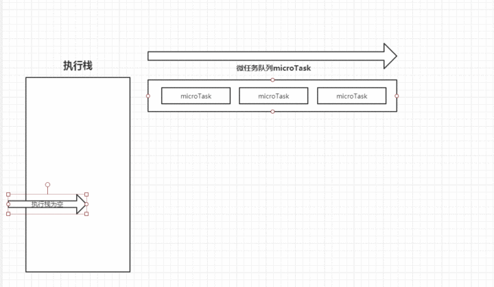
    - 执行栈在执行完同步任务以后,查看执行栈是否为空,如果执行栈为空,就会去执行`task(宏任务)`每次宏任务执行完毕以后,检查是否存在`微任务(microTask)`队列是否为空,如果不为空的话,会按照`先进先出`的规则全部执行完毕`微任务(microTask)`后,设置`微任务(microTask)`队列为`null`然后再去执行宏任务,如此循环,就形成了`事件循环(EventLoop)`

  - **举个栗子**

    - 请说出以下代码输出的结果

      ```js
      console.log('1');
      setTimeout(function() {
        console.log('2');
      }, 0);
      // resolve是一个同步任务,后面虽然调用了then方法,但是执行顺序还是先去执行同步任务,然后再去执行异步任务
      Promise.resolve().then(function() {
        console.log('3');
      }).then(function() {
        console.log('4');
      });
      console.log('5');
      ```

- 第一次执行
  
  - (执行同步代码,将`宏任务(Task)`和`微任务(Microtasks)`划分到各自的队列中)
    
  ```js
      Tasks：run script、 setTimeout callback
      
      Microtasks：Promise then	
      
      JS stack: script	
      Log: script start、script end。
  ```
  
- 第二次执行
  
  - 执行宏任务后，检测到微任务(`Microtasks`)队列中不为空，执行`Promise1`，执行完成`Promise1`后，调用`Promise2.then`，放入微任务(`Microtasks`)队列中，再执行`Promise2.then`
    
  ```js
      Tasks：run script、 setTimeout callback
      
      Microtasks：Promise2 then	
      
      JS stack: Promise2 callback	
      Log: script start、script end、promise1、promise2
  ```
  
- 第三次执行
  
  - 当微任务(`Microtasks`)队列中为空时，执行宏任务（`Tasks`），执行`setTimeout callback`，打印日志
    
  ```js
      Tasks：setTimeout callback
      
      Microtasks：	
      
      JS stack: setTimeout callback
      Log: script start、script end、promise1、promise2、setTimeout
  ```
  
- 第四次执行
  
  - 清空**Tasks**队列和`JS stack`
    
  ```js
      Tasks：setTimeout callback
      
      Microtasks：	
      
      JS stack: 
      Log: script start、script end、promise1、promise2、setTimeout
  ```

### **8、ES5和ES6的继承区别？（class类）**

- **ES5继承**

  - 寄生组合式继承(基本思想)

    - 定义祖先
    - 定义祖先可继承的变量
    - 定义继承的类（构造函数），并在类中调用组件的方法
    - 使用 prototyoe定义继承关系
    - 重新将constructor指向自己
    
    ```js
    function (a){
        this.varA = a;
    }
    
    //定义祖先对象的可继承属性和方法
    A.prototype = {
        varA : null,
        doSomeThing: function(){
            console.log(this.varA);
        },
    }
    
    //定义继承函数
    function B(a,b){
        A.call(this,a);
        this.varB = b;
    }
    //定义继承关系
    B.prototype = Object.create(A.prototype)
    B.prototype.doSomeThing = function(){
        console.log(this.varB);
    }
    //绑定Constructor
    B.prototype.constructor = B;
    
    var b = new B('a','b');
    var a = new A('a');
    a.doSomeThing();
    b.doSomeThing();
    ```
    
    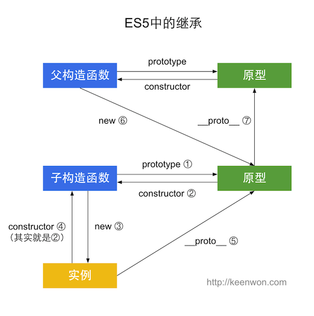
  
- **ES6继承**

  - 基本思想

    - Class之间通过使用extends关键字，这比通过修改原型链实现继承，要方便清晰很多

    ```js
    class Colorpoint extends Point {
        constructor(x,y,color){
            super(x,y); //调用父类的constructor(x,y)
            this.color = color
        }
        toString(){
            //调用父类的方法
            return this.color + ' ' + super.toString();
        }
    }
    ```

  - 注意事项

    - 子类必须在constructo中调用super方法，否则新建实例时会报错,这是因为子类没有自己的this对象，而是继承父类的this对象，然后对其进行加工，如果不调用super方法，子类就得不到this对象,因此，只有调用super之后，才可以使用this关键字

    
    
  - 区别和不同
  
    - 类内部定义的方法,是不可枚举的,和ES5不同
  
    - 类不存在变量提升,这一点和ES5不同
  
    - `类相当于实例的原型,所有在类中定义的方法,都会被实例继承,`如果在一个方法前,加上static关键字,就表示该方法不会被实例继承,而是直接通过类来调用,这就称之为静态方法
  
    - `es5的继承,实质是先创造子类的实例对象this,然后再将父类的方法添加到this上面,es6的继承机制完全不同,实质先创造父类的实例对象this,`所以必须先调用super方法`,然后再用子类的构造函数修改this
  
    - 类的prototype属性和proto属性,大多数浏览器的ES5实现之中,每一个对象都有proto属性,指向对应的构造函数的prototype属性,Class作为构造函数的语法糖,同时有prototype属性proto属性,因此同时存在两条继承链
  
      - 子类的proto属性,表示构造函数的继承,总是指向父类
  
      - 子类的prototype属性的proto属性,表示方法的继承,总是指向父类的prototype属性
  
        ```js
        //类和模块的内部，默认就是严格模式，所以不需要使用use strict指定运行模式。
        //只要你的代码写在类或模块之中，就只有严格模式可用。
        class Point {
            //constructor方法，就是构造方法
            //如果没有定义constructor方法，JS会自动为其添加
            //constructor方法默认返回实例对象（即this），完全可以指定返回另外一个对象。
            constructor(x, y) {
                //this代表实例对象
                this.x = x;
                this.y = y;
                this.tohello = function () {
                    console.log("hello");
                }
            }
            //类的方法，不需要加上function这个关键字
            //下面代码中，toString方法是Point类内部定义的方法，它是不可枚举的。
            //这一点与 ES5 的行为不一致。
            toString() {
                return '(' + this.x + ', ' + this.y + ')';
            }
        
        }
        
        //完全可以看成构造函数的另外一种写法
        Point === Point.prototype.constructor // true
        
        //构造函数的prototype属性，在 ES6 的“类”上面继续存在。
        //事实上，类的所有方法都定义在类的prototype属性上面。
        //除非显示定义在类上面
        //类必须使用new调用，否则会报错。
        //这是它跟普通构造函数的一个主要区别，后者不用new也可以执行。
        let p = new Point('x', 'y');
        p.tohello();
        // p.prototype.tohello();  //false
        
        //与 ES5 一样，类的所有实例共享一个原型对象。
        var p1 = new Point(2, 3);
        var p2 = new Point(3, 2);
        
        p1.__proto__ === p2.__proto__
        //true
        //上面代码中，p1和p2都是Point的实例，它们的原型都是Point.prototype，所以__proto__属性是相等的。
        //这也意味着，可以通过实例的__proto__属性为“类”添加方法。
        //__proto__ 并不是语言本身的特性，这是各大厂商具体实现时添加的私有属性，
        //虽然目前很多现代浏览器的 JS 引擎中都提供了这个私有属性，
        //但依旧不建议在生产中使用该属性，避免对环境产生依赖。
        //生产环境中，我们可以使用 Object.getPrototypeOf 方法来获取实例对象的原型，然后再来为原型添加方法/属性。
        
        //不推荐下面的做法
        p1.__proto__.printName = function () {
            return 'Oops'
        };
        
        p1.printName() // "Oops"
        p2.printName() // "Oops"
        
        var p3 = new Point(4, 2);
        p3.printName() // "Oops"
        //类不存在变量提升（hoist），这一点与 ES5 完全不同。
        
        class Foo {
            //静态方法，只能通过类来调用
            //父类的静态方法也会被子类继承
            static classMethod() {
                return 'hello';
            }
        }
        
        Foo.classMethod() // 'hello'
        
        var foo = new Foo();
        //  foo.classMethod()
        // TypeError: foo.classMethod is not a function
        
        //实现继承
        class ColorPoint extends Point {
            constructor(x,y,color){
                //调用父类的构造函数，用来新建父类的this对象
                //super作为函数调用时，返回的是子类B的实例，super内部的this指向B
                //super相当于 A.prototype.constructor.call(this)
                //super作为函数只能用在constructor中
                super(x,y);
        
                //子类必须使用super方法，否则子类没有自己的this对象
                //继承父类的this对象然后进行加工
                this.color = color;
            }
        
            toString() {
                //super作为对象使用时，指向父类的原型对象。
                //在静态方法中指向父类
                //定义在父类实例上的方法是没办法用的
                return this.color + ' ' +super.toString();//调用父类的方法
            }
        }
        
        //可以使用getPrototypeOf方法来获取父类
        Object.getPrototypeOf(ColorPoint) === Point
        
        ColorPoint.__proto__ == Point; //true
        ColorPoint.prototype.__proto__ == Point.prototype;//true
        
        //这里和es5不一样
        //对象有属性__proto__,指向该对象的构造函数的原型对象。
        //方法除了有属性__proto__,还有属性prototype，prototype指向该方法的原型对象。
        
        var p1 = new Point(2, 3);
        var p2 = new ColorPoint(2, 3, 'red');
        
        // p2.__proto__ === p1.__proto__ // false
        p2.__proto__.__proto__ === p1.__proto__ // true
        ```
  
        

### **9、箭头函数**

- 箭头函数是ES6中新增的一种声明函数的方式,和普通函数主要存在以下区别,分别是`书写形式区别`,`this指向`,`参数语法区别`

- 语法区别

  ```js
  // 1- es5中声明函数的方式
        function fn() {
          let num = 20
          console.log(num)
          return num
        }
        fn()
  
  // 2- es6中箭头函数
        let fn2 = () => {
          let num = 20
          console.log(num)
          return num
        }
        fn2()
  ```

- this指向区别

  - 箭头函数内部的this根据词法作用域,由上下文确定

  ```js
  // 1- 普通函数 
  let Person = {
          name: 'jack',
          age: 20,
          sayHi: function () {
            console.log(this) // {name: "jack", age: 20, sayHi: ƒ}
            var fn = function () {
              console.log(this) // window
              return console.log(this.name + this.age)
            }
            return fn()
          },
        }
        Person.sayHi()
  ```

  - 使用箭头函数方式

  ```js
   let Person = {
          name: 'jack',
          age: 20,
          sayHi: function () {
            console.log(this) // {name: "jack", age: 20, sayHi: ƒ}
            var fn = () => {
              console.log(this) // {name: "jack", age: 20, sayHi: ƒ}
              return console.log(this.name + this.age) // jack 20
            }
            return fn()
          },
        }
        Person.sayHi()
  ```

- 参数区别

  ```js
        // 3- 参数区别
        // 3-1 没有参数
        function fn() {}
        let fn = () => {}
  
        // 3-2 单个参数
        function fn(data) {}
        let fn = (data) => {}
  
        // 3-3 多个参数
        function fn(data, value) {}
        let fn = (data, value) => {}
  
        // 3-4 可变参数
        function fn(data, value, ...arguments) {}
        let fn = (data, value, ...arguments) => {}
  
  ```


## Webapi

### **1、如何阻止事件冒泡**

- 标准解决的方式为:  e.stopPropagation() 
- 兼容IE的方式为:  e.cancelBubble = true
- return false的说明: return false的方式,在原生js中只会阻止`默认行为,不会阻止事件冒泡`,但是在jquery中,可以做到`阻止事件冒泡,也可以阻止默认行为`

```js
function stopBubble(e) { 
//如果提供了事件对象，则这是一个非IE浏览器 
if ( e && e.stopPropagation ) {
    //因此它支持W3C的stopPropagation()方法 
    e.stopPropagation(); 
}
else {
     //否则，我们需要使用IE的方式来取消事件冒泡 
    window.event.cancelBubble = true; 
	}

```

### **2、谈谈事件委托的理解**

- 事件委托就是,利用事件冒泡的特性，将本应该注册在子元素上的处理事件注册在父元素上，这样点击子元素时发现其本身没有相应事件就到父元素上寻找作出相应。
- 这样做的优势有：1.减少DOM操作，提高性能 2.随时可以添加子元素，添加的子元素会自动有相应的处理事件

```html
<!DOCTYPE html>
<html lang="en">
  <head>
    <meta charset="UTF-8" />
    <meta name="viewport" content="width=device-width, initial-scale=1.0" />
    <meta http-equiv="X-UA-Compatible" content="ie=edge" />
    <title>Document</title>
  </head>
  <body>
    <input type="button" name="" id="btn" value="添加" />
    <ul id="ul1">
      <li>111</li>
      <li>222</li>
      <li>333</li>
      <li>444</li>
    </ul>

    <script>
      window.onload = function () {
        var oBtn = document.getElementById('btn')
        var oUl = document.getElementById('ul1')
        var aLi = oUl.getElementsByTagName('li')
        var num = 4

        //事件委托，添加的子元素也有事件
        oUl.onmouseover = function (ev) {
          // 兼容ie的判断
          var ev = ev || window.event
          var target = ev.target || ev.srcElement
           // 获取目标节点,确定是li,添加对应style属性
          if (target.nodeName.toLowerCase() == 'li') {
            target.style.background = 'red'
          }
        }
        oUl.onmouseout = function (ev) {
          var ev = ev || window.event
          var target = ev.target || ev.srcElement
          // 获取目标节点,确定是li,添加对应style属性
          if (target.nodeName.toLowerCase() == 'li') {
            target.style.background = '#fff'
          }
        }
        //添加新节点
        oBtn.onclick = function () {
          num++
          var oLi = document.createElement('li')
          oLi.innerHTML = 111 * num
          oUl.appendChild(oLi)
        }
      }
    </script>
  </body>
</html>

```

### **3、事件执行过程**

- 当某个元素绑定的事件被触发时，这时浏览器就会从顶级document元素发出一个事件流

-  这个事件流顺着dom层级，一层一层向下找，直到遇到了触发事件的目标元素，这个查找的过程是捕获阶段

   说明：捕获阶段，在查找每一层dom时，遇到相同的事件默认不执行，元素的事件默认在冒泡阶段执行

- 到达目标元素后会触发目标元素绑定的事件函数，也就是目标元素事件函数处理阶段

- 在处理过目标元素事件后，在顺着dom层级一层一层向上查找，这时对应dom上如果有相同的事件，默认会被触发，冒泡阶段

- 总结: 事件触发,其实会经历`捕获阶段,执行阶段,冒泡阶段`注意: 只有两个阶段能同时执行（捕获 + 执行、或者 执行 + 冒泡 ）

- 补充: 捕获阶段的处理函数最先执行,其次是目标阶段的处理函数,最后是冒泡阶段的处理函数,目标阶段的处理函数,先注册的先执行,后注册的后执行

```html
<!DOCTYPE html>
<html lang="en">
<head>
    <meta charset="UTF-8">
    <meta name="viewport" content="width=device-width, initial-scale=1.0">
    <meta http-equiv="X-UA-Compatible" content="ie=edge">
    <title>Document</title>
</head>
<body>
    
  <div class="box" style="width:300px;height:300px;background:green;" onclick="firstClick()">
    parent
    <div class="child" onclick="secondClick()">child
        <div class="button" onclick = "thirdClick()">提交</div>
    </div>
</div>
<script>
    var divs=document.querySelectorAll("div");//获取所有的divs
    function firstClick(){
        alert('firstClick')
    }
    function secondClick(){
        alert('secondClick')
    }
    function thirdClick(){
        alert('thirdClick')
    }
    function fn0(){
        alert("box");
    }
    function fn1(){
        alert("child");
    }
    function fn2(){
        alert("but");
    }
    //addEventListener有三个参数，最后一个参数是决定元素事件的触发阶段，默认是false，在冒泡阶段执行，设置为true,则在捕获阶段执行。
    divs[0].addEventListener("click",fn0,false);
    divs[1].addEventListener("click",fn1,false);
    divs[2].addEventListener("click",fn2,false);
</script>
</body>
</html>
```

### **4、本地存储 localStorage和sessionStorage的区别**

- **生命周期**
  - localStorage`生命周期是永久`，这意味着除非用户显示在浏览器提供的UI上清除localStorage信息，否则这些信息将永远存在。存放数据大小为一般为5MB,而且它仅在客户端（即浏览器）中保存，不参与和服务器的通信
  - sessionStorage`仅在当前会话下有效`，`关闭页面或浏览器后被清除`。存放数据大小为一般为5MB,而且它仅在客户端（即浏览器）中保存，不参与和服务器的通信。源生接口可以接受，亦可再次封装来对Object和Array有更好的支持
- **作用域不同**
  - 不同浏览器无法共享localStorage或sessionStorage中的信息,相同浏览器的不同页面间可以共享相同的 localStorage（页面属于相同域名和端口）
  - 但是不同页面或标签页间无法共享sessionStorage的信息,这里需要注意的是，页面及标 签页仅指顶级窗口，如果一个标签页包含多个iframe标签且他们属于同源页面，那么他们之间是可以共享sessionStorage的
- **存储内容类型**
  - localStorage和sessionStorage只能存储字符串类型，对于复杂的对象可以使用ECMAScript提供的JSON对象的stringify()和parse()来处理
- **应用场景区别**
  - localStoragese：常用于长期登录（判断用户是否已登录），适合长期保存在本地的数据
  - sessionStorage：敏感账号一次性登录

## Js高级

### **1、谈谈你对闭包的理解**

- **闭包的概念**

  - 闭包函数就是能够读取其它函数局部变量的函数

- **理解变量作用域**

  - 首先要理解一下变量作用域,在js中无外乎分为`局部作用域`,`全局作用域`,特点是,局部作用域,可以访问全局作用域声明的变量,但是全局作用域下,无法访问局部作用域下声明的变量

    ```js
    // 1- 在函数内部,可以访问全局下声明的变量
    var n=999;
    function f1(){
    　　　alert(n);
    　　}
    　f1(); // 999
    // 2- 读取函数内部的变量,是无法访问的
    function f1(){
    　　　var n=999;
    　　}
    　　alert(n); // error
    
    // 3- 需要注意,如果在函数内部不使用var申请变量,那么会变成一个全局的变量
    function f1(){
    　　　 n=999;
    　　}
    　　alert(n); // 999 
    
    ```

- **如何从函数外部读取局部变量**

  - 通过上述的演示,想要获取到内部变量,是无法实现的,这个时候,要想获取的话,可以在函数内部在去定义一个函数

    ```js
     function f1() {
          var  n = 999
            function f2() {
              alert(n) // 999
            }
          }
          /*
          在上面的代码中，函数f2就被包括在函数f1内部，这时f1内部的所有局部变量，对f2都是可见的。但是反过来就不行，f2内部的局部变量，对f1 就是不可见的。
          这就是Javascript语言特有的“链式作用域”结构（chain scope），子对象会一级一级地向上寻找所有父对象的变量。所以，父对象的所有变量，对子对象都是可见的，反之则不成立。
          既然f2可以读取f1中的局部变量，那么只要把f2作为返回值，我们不就可以在f1外部读取它的内部变量了吗！
        */
    ```

  - 改写成以下方式

    ```js
    function f1() {
            var n = 999
            function f2() {
              alert(n)
            }
            return f2
          }
          var result = f1()
          result() // 999
    ```

- **闭包函数的用途**

  - 实现公有变量(函数累加器)

    ```js
    function add(){
    		var num = 0;
    		function a(){
    			console.log( ++ num);
    		}
    		return a;
    	}
    	var myadd = add();
    	myadd();//结果为1
    	myadd();//结果为2
    ```

  - 可以缓存(存储结构)

  - 可以实现封装(私有化变量)

    ```js
    function Deng(name,wife){
    	var prepareWife = "传智教育";
    	this.name = name;
    	this.wife = wife;
    	this.divorce = function(){
    		this.wife = prepareWife;
    	}
    	this.changePrepareWife = function(target){
    		prepareWife = target;
    	}
    	this.sayPrepareWife = function(){
    		console.log(prepareWife);
    	}
    }
    	var deng = new Deng('黑马','传智');
    ```

- **闭包函数的注意事项**

  - 由于闭包会使得函数中的变量都被保存在内存中，内存消耗很大，所以不能滥用闭包，否则会造成网页的性能问题，在IE中可能导致内存泄露。解决方法是，在退出函数之前，将不使用的局部变量全部删除。
  -  闭包会在父函数外部，改变父函数内部变量的值。所以，如果你把父函数当作对象（object）使用，把闭包当作它的公用方法（Public Method），把内部变量当作它的私有属性（private value），这时一定要小心，不要随便改变父函数内部变量的值

###  **2、谈谈你对原型、原型链的理解及如何延长作用域链？**

- **原型**

  - 在JavaScript中,每当定义一个,函数数据类型(普通函数,类)时候,都会天生自带一个`prototype`属性,这个属性指向函数的原型对象,并且这个属性是一个对象数据类型的值

    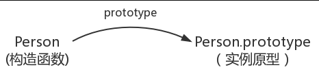

- **原型链**

  - 每一个对象数据类型(普通的对象、实例、`prototype`......)也天生自带一个属性`__proto__`，属性值是当前实例所属类的原型(`prototype`)。原型对象中有一个属性`constructor`, 它指向函数对象。

    ```js
      function Person() {}
        var person = new Person()
        console.log(person.__proto__ === Person.prototype)//true
        console.log(Person.prototype.constructor===Person)//true
        //顺便学习一个ES5的方法,可以获得对象的原型
        console.log(Object.getPrototypeOf(person) === Person.prototype) // true
    ```

    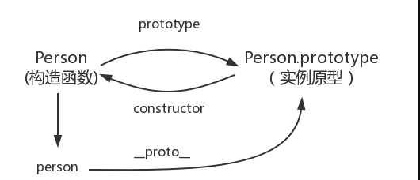

    - 创建Person函数,通过`prototype`属性,可以访问当前Person函数的原型对象
    - 在Person函数的原型对象中,存在一个`constructor`属性(构造器),指向的就是Person函数本身
    - Person最终需要使用new Person()创建为一个对象,此时就称之为`实例对象`,被new出来的这个实例对象,可以通过`__proto__`访问原型对象
    - 简述原型链: 当前实例对象访问原型对象上的方法,如何当前原型对象存在访问的方法,那么就用,否则沿着当前向上一次查找,查找到最顶级为: `Object.prototype`那么此时为访问到`null`

- **延长作用域链**

  - 在javaScript中执行环境,只有全局函数,和局部函数,但还是有其它的方式,来延长作用域,实现的原理可以在作用域的前端,加上一个`变量对象`,并且该变量在执行完毕之后会被销毁

  - 有两种情况,可以达到这种效果

    - try-catch语句的catch块: try中的代码捕获到错误以后，会把异常对象推入一个可变对象并置于作用域的头部，在catch代码块内部，函数的所有局部变量将会被放在第二个作用域对象中，catch中的代码执行完，会立即销毁当前作用域。

      ```html
      <html>
      <head>
      <script type="text/javascript">
          var txt="";
          function message(){
            try{
                   adddlert("Welcome guest!")
               }
            catch(err){
               txt="本页中存在错误。\n\n";
               txt+="错误描述：" + err.description + "\n\n";
               txt+="点击“确定”继续。\n\n";
               alert(txt);
             }
      }
      </script>
      </head>
      <body>
          <input type="button" value="查看消息" onclick="message()" />
      </body>
      </html>
      ```

    - with语句: 这两个语句都会在作用域链的前端添加一个变量对象。对with语句来说，会将指定的对象添加到作用域链中。对catch语句来说，会创建一个新的变量对象，其中包含的是被抛出的错误对象的声明

      ```js
      function buildUrl() {
          var qs = "?debug=true";
          with(location){
              var url = href + qs;
          }
          return url;
      }
      ```

    - 之前的作用域为

      - window全局对象
      - buildUrl的变量对象

    - 加入with语句以后

      - widndow全局对象
      - buildUrl的变量对象
      - with的loction对象

    - with语句接收的是Location对象,因此其变量中就包含了Location对象的所有属性和方法,而这个对象被添加到了作用域链的最前端,`buildUrl()`函数中定义了一个变量`qs`,当在with语句中引用变量`href`时(实际引用的是location.href),可以在当前执行环境的变量对象中找到,当引用变量qs时,引用的则是在`buildUrl()`中定义的那个变量,而该变量的位于函数环境的变量对象中,至于with语句内部,则定义了一个名为url的变量,因而url就成了函数执行环境的一部分,所以可以作为函数的值被返回

### **3、Call和apply，bind的区别**

- **基本定义**
  - apply：调用一个对象的一个方法，用另一个对象替换当前对象, 例如：`B.apply(A, arguments);即A对象应用B对象的方法`
  - call：调用一个对象的一个方法，用另一个对象替换当前对象, 例如：`B.call(A, args1,args2);即A对象调用B对象的方法`
  - bind: 一个函数被`call/apply`的时候,会被直接调用,但是`bind`会创建一个新的函数,当这个函数被调用时,`bind()`的第一个参数将作为它运行时的`this`,之后的一序列参数,将会在传递的实参前传入作为它的参数
  
- **相同之处**
  
  - 都可以用来代替一个对象调用一个方法,将一个函数的对象从上下文初始的上下文,更改为`thisObj`指定的方法
  
- **不同之处**
  - apply：最多只能有两个参数——新this对象和一个数组argArray。如果给该方法传递多个参数，则把参数都写进这个数组里面，当然，即使只有一个参数，也要写进数组里。如果argArray不是一个有效的数组或arguments对象，那么将导致一个TypeErro,如果没有提供argArray和thisObj任何一个参数，那么Global对象将被用作thisObj，并且无法被传递任何参数
  - call：它可以接受多个参数，第一个参数与apply一样，后面则是一串参数列表,这个方法主要用在js对象各方法相互调用的时候，使`当前this实例指针保持一致`，或者在特殊情况下需要改变this指针。如果没有提供thisObj参数，那么 Global 对象被用作thisObj
  - bind：会创建一个新的函数（称为绑定函数），新函数与被调函数（绑定函数的目标函数）具有相同的函数体，当目标函数被调用this值绑定到bind()的第一个参数，该参数不能被重写，绑定函数被调用时，bind()也接收预设的参数提供给原函数，一个绑定函数也能使用new操作符创建对象，这种行为相遇于把原函数当做一个构造器，提供的this值被忽略，同时调用时的参数，被提供给模拟函数
  - 实际上，apply和call的功能是一样的，只是传入的参数列表形式不同,`apply只可以接收一个数组,而call可以接收多个参数`，`bind除了返回的是一个函数以外`，它的参数和call是一样的
  
- **使用场景**

  - call

    - 实现继承

    ```js
    function Animal (name){
        this.name = name;
        this.showName=function(){
            console.log(this.name)
        }
    } 
    function Cat(name){
        Animal.call(this,name)
    }
    var cat = new Cat('Black Cat')
    cat.showName()
    ```

    - 将伪数组转化成数组

    ```js
    var fakeArr = {0:'a',1:'b',2:'c',3:'d',length:2}
    var arr1 = Arra.prototype.slice.call(fakeArr)
    console.log(arr1[0])
    var arr2 = [].slice.call(fakeArr)
    console.log(arr2[0])
    arr1.push('c')
    console.log(arr1)
    ```

  - apply

    - 数组添加

    ```js
    // 数组添加
    var arr1 = [12,23,5]
    var arr2=['jack','rows','mac']
    Array.prototype.push.apply(arr1,arr2)
    console.log(arr1)
    ```

    - 获取数组最大值和最小值

    ```js
    var num = [12,43,5,67,7,90,6]
    var maxNum = Math.max.apply(Math,num)
    var minNum = Math.min.apple(Math,num)
    console.log(maxNum)
    console.log(minNum)
    ```

  - bind

    - 保存this变量

    ```js
    var foo = {
        bar : 1,
        eventBind: function(){
            var _this = this ;
            $('.someClass').on('click',function(event) {
                console.log(_this.bar);     
            });
        }
    }
    var foo = {
        bar : 1,
        eventBind: function(){
            $('.someClass').on('click',function(event) {
                console.log(this.bar);      
            }.bind(this));
        }
    ```

### 4、**常见的js中的继承方法有哪些**

- **4-1 原型链继承方式**

  - **重点:**
  - 让实例的原型等于父类的实例
  - **特点:**
    - 实例可以继承属性,实例的构造函数属性,父类构造函数属性,父类原型属性(新实例不会继承父类实例的属性)
  - **缺点:**
    - 新实例无法向父类构造函数传参
    - 继承较为单一化
    - 有新实例都会共享父类实例属性(原型上的属性都是共享的)
  
  
  ```js
  //    1- 使用原型链实现继承
     function Person(name){
         this.name = name||'Person'
         this.sleep=function(){
             console.log('my is Person eat')
         }
     }
  Person.prototype.eat=function(){
      console.log('my is Person prototype ')
  }
  // 2- 创建子类实现继承
  function Cat () {}
  student.prototype=new Person()
  var p = new Student()
  console.log(p.name)
  ```
  
- **4-2  构造函数继承方式**

  - **重点:**
  - 使用call()和apply()方法,将父类构造函数引入子类构造函数(在子类函数中做了父类函数的自执行)
  - **特点:**
    - 只继承了父类的属性,但是没有继承父类原型的属性
    - 解决了原型继承中的1,2,3点缺陷
    - 可以继承多个构造函数属性(call多个)
    - 可以在子实例中向父级实例传参
  - **缺点:**
  - 只能继承父类构造函数的属性
    - 无法实现构造函数复用(每次复用都要重新调用)
    - 每个新实例都有父类构造函数的副本
  
  ```js
        function Cat(name) {
          Animal.call(this)
          this.name = name || 'jack'
        }
       // Test Code
        var cat = new Cat()
        console.log(cat.name)
        console.log(cat.sleep())
        console.log(cat instanceof Animal) // false
        console.log(cat instanceof Cat) // true
  ```
  
- **4-3 组合继承方式**

  - **重点:**
    - 结合原型继承/构造函数的优点,传参和复用
  - **特点:**
    - 可以继承父类原型上的属性,可以传参,复用
    - 每个新实例引入的构造函数属性,都是私有的
  - **缺点:**
    - 调用了两次父类构造函数(消耗内存)
    - 子类的构造函数会代替原型上那个父类构造函数

  ```js
  function Cat(name){
   Animal.call(this,name)
  }
  Animal.prototype=new Animal()
  // Test Code
  var cat = new Cat();
  console.log(cat.name);
  console.log(cat.sleep());
  console.log(cat instanceof Animal); // false
  console.log(cat instanceof Cat); // true
  ```

- **4-4 实例继承方式**

  - **重点:**
  - 为父类实例添加新特性,作为子类返回
  - **特点:** 
    - 不限调用方式,不管new()还是子类()返回的对象都有相同的效果
  - **缺点:**
    - 实例是父类的实例,不是子类的实例
    - 不支持多继承

  ```js
  function Cat(name){
    var instance= new Animal()
    instance.name=name||'jack'
     return instance
  }
  // Test Code
  var cat = Cat(anm)
  console.log(cat.name);
  console.log(cat.sleep());
  console.log(cat instanceof Animal); // true
  console.log(cat instanceof Cat); // false
  ```

- **4-5 拷贝继承方式**

  - **重点:**
    - 使用for in 循环的方式,把父类进行循环
  - **特点:**
    - 支持多继承的方式
  - **缺点:**
    - 效率较低,内存占用高(拷贝父类的属性/方法)
    - 无法获取父类不可枚举的方法

  ```js
  function Cat(name){
    var animal = new Animal();
    for(var p in animal){
      Cat.prototype[p] = animal[p];
    }
    this.name = name || 'Tom';
  }
  
  // Test Code
  var cat = new Cat();
  console.log(cat.name);
  console.log(cat.sleep());
  console.log(cat instanceof Animal); // false
  console.log(cat instanceof Cat); // true
  ```

- **4-6 寄生组合继承方式**

  - **重点:**
  - 其实就是用一个新的构造函数,当做一个中转,来实现的继承
  - **特点:**
    - 结合了构造继承以及原型继承的方式实现的
- **缺点:**
    - 实现过程较为复杂
    
  ```js
  function Cat(name){
    Animal.call(this);
    this.name = name || 'Tom';
  }
  (function(){
    // 创建一个没有实例方法的类
    var Super = function(){};
    Super.prototype = Animal.prototype;
    //将实例作为子类的原型
    Cat.prototype = new Super();
  })();
  
  // Test Code
  var cat = new Cat();
  console.log(cat.name);
  console.log(cat.sleep());
  console.log(cat instanceof Animal); // true
  console.log(cat instanceof Cat); //true
  ```

### **5、this指向**

- this关键字,在调用之前无法确定,只有在最终调用时,才会确定最终的指向,但是主要出现的场景有以下几种

  ```js
  // 1- 普通函数
        function f1() {
          console.log(this) // window  严格模式下,指向的是,undefined
        }
        f1()
  
        // 2- 在定时器中
        setTimeout(
          (function () {
            console.log(this) // window
          })(),
          1000
        )
  
        // 3- 在事件中
        var btn = document.querySelector('#btn')
        btn.onclick = function () {
          console.log(this) // 指向事件源
        }
  
        // 4- 在对象的属性中
        function Person(name, age) {
          this.name = name
          this.age = age
          this.sayHi = function () {
            console.log(this)
          }
        }
        var NewPerson = new Person('jack', 20)
        console.log(NewPerson.name) // 指向的是实例对象
  
        // 5- 在对象的方法中
        function PersonHi(name, age) {
          this.name = name
          this.age = age
          this.sayHi = function () {
            console.log(this)
          }
        }
        var NewPersonHi = new PersonHi('jack', 20)
        console.log(NewPersonHi.sayHi()) // 指向的是,当前方法的对象
  
        // 6- 在箭头函数中的this
        let obj = {
          name: 'jack',
          age: 20,
          sayHi: function () {
            var sayHiOne = () => {
              return console.log(this.name + this.age) // 指向的是,当前上级的对象
            }
            return sayHiOne()
          },
        }
        console.log(obj.sayHi())
  
        // 7- 补充: 当this遇到return的时候
        function _thisReturn() {
          this.name = 'jack'
          return {} // 一个空的对象,那么this指向返回的那个对象,
        }
        let newObj = new _thisReturn()
        console.log(newObj.name) // undefined
  
        // 如果声明的一个null类型,那么指向还是最后的实例对象
        function _thisReturn() {
          this.name = 'jack'
          return null
        }
        let newObj = new _thisReturn()
        console.log(newObj.name) // jack  
  
       // 如果声明的是一个undefined的话,那么指向还是最后的实例对象
        function _thisReturn() {
          this.name = 'jack'
          return undefined
        }
        let newObj = new _thisReturn()
        console.log(newObj.name) // jack
  ```

### **6、深拷贝和浅拷贝的区别（拓展需要掌握）**

- **基本定义**

  - 浅拷贝
    - 创建一个新的数据，这个数据有着原始数据属性值的一份精确拷贝。如果属性是基本类型，拷贝的就是基本类型的值，如果属性是引用类型，拷贝的就是内存地址，所以如果其中一个数据改变了这个地址，就会影响到另一个数据
  - 深拷贝
    - 深拷贝会拷贝所有的属性，并拷贝属性指向的动态分配的内存。当对象和它所引用的对象一起拷贝时即发生深拷贝。深拷贝相比于浅拷贝速度较慢并且花销较大。在堆中重新分配内存，拥有不同的地址，且值是一样的，复制后的对象与原来的对象是完全隔离，互不影响。
  
- **示例介绍**

  - **浅拷贝**(浅拷贝只会将`对象的各个属性`进行复制，并不会进行递归复制，而JavaScript存储对象是存地址的，所以浅复制会导致Obj.arr和shallowObj.arr指向同一块内存地址)

  ```js
  var a = [1, 2, 3, 4, 5];
  var b = a;
  a[0] = 2
  console.log(a);
  console.log(b);
  
  //因为b浅拷贝a, ab指向同一个内存地址(堆内存中存的值)
  //b会随着a的变化而变化
  //[2, 2, 3, 4, 5]
  //[2, 2, 3, 4, 5]
  
  ******************分割线********************
  //此递归方法不包含数组对象
  var obj = { a:1, arr: [2,3] };
  var shallowObj = shallowCopy(obj);
   function shallowCopy(src) {
      var newobj = {};
    for (var prop in src) {
        if (src.hasOwnProperty(prop)) {
          newobj[prop] = src[prop];
        }
      }
      return newobj;
    }
    shallowObj.arr[1] = 5;
    console.log(obj.arr[1]);     //5
    
  ```

- **深拷贝**(深拷贝则不同，它不仅将原对象的各个属性逐个复制出去，而且将原对象各个属性所`包含的对象`也依次采用深复制的方法递归复制到新对象上,这就不会存在obj和shallowObj的arr属性指向同一个对象的问题)

  ```js
   var obj = { 
        a:1, 
        arr: [1,2]，
        nation : '中国',
        birthplaces:['北京','上海','广州']
    };
    var obj2 = {name:'杨'};
    obj2 = deepCopy(obj,obj2);
    console.log(obj2);
    //深复制，要想达到深复制就需要用递归
    function deepCopy(o, c){
          var c = c || {};
          for(var i in o){
              if(typeof o[i] === 'object'){
                   if(o[i].constructor === Array){
                        //这是数组
                        c[i] = [];
                   }else{
                        //这是对象
                        c[i] = {};
                   }
                   deepCopy(o[i], c[i]);
              }else{
                   c[i] = o[i];
              }  
           }
           return c;
    }
  ```
  
  

### **7、js如何处理防抖和节流（很重要）**

- **基本定义**

  - 防抖函数/节流函数,都是为了限制函数的执行频次，以优化函数触发频率过高导致的响应速度跟不上触发频率，出现延迟，假死或卡顿的现象

- **防抖函数**

  - 当持续的触发一个事件时(resize，scoll，mousemove，mouseover)一定时间内再没有触发该事件,事件处理函数才会执行一次,如果设定的时间到来之前,又触发了一次,那么就需要延时触发,`触发高频事件后n秒内函数只会执行一次，如果n秒内高频事件再次被触发，则重新计算时间`

    ```js
    /* 
          1. 防抖: 实现方式：每次触发事件时设置一个延迟调用方法，并且取消之前的延时调用方法
            缺点：如果事件在规定的时间间隔内被不断的触发，则调用方法会被不断的延迟
         */
        function debounce(fn, delay) {
          // 创建一个标记来存放定时器的返回值
          var timeout = null;
          return function (e) {
            // 每当用户操作时,把之前的计时器清零
    　　　　if(timeout !== null) {
              clearTimeout(timeout);
            }
    // 然后又创建一个新的 setTimeout, 这样就能保证interval 间隔内如果时间持续触发，就不会执 行 fn 函数
            timeout = setTimeout(() => {
              fn.apply(this, arguments);
            }, delay)
          }
        }
        // 处理函数
        function handle() {
          console.log('防抖：', Math.random());
        }
        //点击事件
        window.addEventListener('click', debounce(handle, 500));
    ```
    
  - **实现原理:** `将多次操作合并为一次操作进行。原理是维护一个计时器，规定在delay时间后触发函数，但是在delay时间内再次触发的话，就会取消之前的计时器而重新设置。这样一来，只有最后一次操作能被触发。`
  
- 节流函数

    - 节流函数,`高频事件触发，但在n秒内只会执行一次，所以节流会稀释函数的执行频率`,比如重复调用ajax请求,不仅会造成请求混乱,并且还有造成网络堵塞,占用服务器带宽,节流函数使用一次性定时器实现的

      ```js
      // 时间戳
          var throttle = function (func, delay) {
            var prev = Date.now();
            return function () {
              var context = this;
              var args = arguments;
              var now = Date.now();
              if (now - prev >= delay) {
                func.apply(context, args);
                prev = Date.now();
              }
            }
          }
          //定时器
          // 节流throttle代码（定时器）：
    var throttle = function (func, delay) {
            var timer = null;
        return function () {
              var context = this;
              var args = arguments;
              if (!timer) {
                timer = setTimeout(function () {
                  func.apply(context, args);
                  timer = null;
                }, delay);
              }
            }
          }// 节流函数
          function throttle(fn, delay) {
              let flag = true;
              return function (...args) {
                  if (!flag) {
                      return;
                  }
                  flag = false;
                  setTimeout(() => {
                      fn(...args)
                      flag = true;
                  }, delay);
              }
          }
      ```
      
    - **实现原理:** `使得一定时间内只触发一次函数,原理是通过判断是否有延迟调用函数未执行`,函数节流不管事件触发有多频繁，都会保证在规定时间内一定会执行一次真正的事件处理函数，而函数防抖只是在最后一次事件后才触发一次函数。 比如在页面的无限加载场景下，我们需要用户在滚动页面时，每隔一段时间发一次 Ajax 请求，而不是在用户停下滚动页面操作时才去请求数据, 这样的场景，就适合用节流技术来实现。
    

### **8、如何延长作用域链？**

- 在javaScript中执行环境,只有全局函数,和局部函数,但还是有其它的方式,来延长作用域,实现的原理可以在作用域的前端,加上一个`变量对象`,并且该变量在执行完毕之后会被销毁

- 有两种情况,可以达到这种效果

  - with语句: 这两个语句都会在作用域链的前端添加一个变量对象。对with语句来说，会将指定的对象添加到作用域链中。对catch语句来说，会创建一个新的变量对象，其中包含的是被抛出的错误对象的声明

    ```js
    function buildUrl() {
        var qs = "?debug=true";
        with(location){
            var url = href + qs;
        }
        return url;
    }
    ```

  - try-catch语句的catch块: try中的代码捕获到错误以后，会把异常对象推入一个可变对象并置于作用域的头部，在catch代码块内部，函数的所有局部变量将会被放在第二个作用域对象中，catch中的代码执行完，会立即销毁当前作用域。

    ```js
    <html>
    <head>
    <script type="text/javascript">
        var txt="";
        function message(){
          try{
                 adddlert("Welcome guest!")
             }
          catch(err){
             txt="本页中存在错误。\n\n";
             txt+="错误描述：" + err.description + "\n\n";
             txt+="点击“确定”继续。\n\n";
             alert(txt);
           }
    }
    </script>
    </head>
    <body>
        <input type="button" value="查看消息" onclick="message()" />
    </body>
    </html>
    
    ```

    - 之前的作用域为:

      - window全局对象
      - buildUrl的变量对象

    - 加入with语句以后

      - widndow全局对象
      - buildUrl的变量对象
      - with的loction对象

    - with语句接收的是location对象,因此其变量中就包含了location对象的所有属性和方法,而这个对象被添加到了作用域链的最前端,`buildUrl()`函数中定义了一个变量`qs`,当在with语句中引用变量`href`时(实际引用的是location.href),可以在当前执行环境的变量对象中找到,当引用变量qs时,引用的则是在`buildUrl()`中定义的那个变量,而该变量的位于函数环境的变量对象中,至于with语句内部,则定义了一个名为url的变量,因而url就成了函数执行环境的一部分,所以可以作为函数的值被返回


### **9、super的作用 如何使用**

- **基本定义:**

  - this指向当前函数所在的当前对象
  - super指向当前对象所在的原型对象

- **使用区别:**

  - super()当做函数使用时
    - 当做函数时,`super()`代表是父类构造函数,所以要求,必须执行一次
    - 当做函数时,只能在子类构造函数中使用,否则会报错
  - super()当做对象使用时
    - 在普通方法中,指向父类的原型对象
    - 在静态方法`(static)`中,指向父类
    - 由于对象总是继承与其它对象,所以在任意对象中也可以使用super关键字
  
- **super()当做函数使用时**

  - `super`关键字,既可以当做函数使用,也可以当做对象使用,在这两种情况下,使用方法完全不同

  - 1- `super`当做函数调用时,代表父类的构造函数,es6中要求,子类的构造函数必须要执行一次`super()`

    ```js
  class A {}
    class B extendes A {
        constructor() {
            super() // 必须执行一次super(),否则会报错
        }
    }
    ```
  
  - 以下代码中`super`方法,虽然代表了父类A的构造函数,但是返回的确是子类B的实例,`super`内部的this指向的还是,B的实例,因为在这里`super()`相当于`A.prototype.constructor.call(this)`

    ```js
    class A {
      constructor() {
        console.log(new.target.name);
      }
    }
    class B extends A {
      constructor() {
        super();
      }
    }
    new A() // A
    new B() // B
    ```
    
  - 2- 作为函数时，`super()`只能用在子类的构造函数之中，用在其他地方就会报错

    ```js
  class A {}
    class B extends A {
      m() {
        super(); // 报错
      }
    }
    ```
  
- **super()当做对象使用时**

  - 1-`super`作为对象时，在普通方法中，指向父类的原型对象；在静态方法中，指向父类

    ```js
    class A {
      p() {
        return 2;
      }
    }
    
    class B extends A {
      constructor() {
        super();
        console.log(super.p()); // 2
      }
    }
    let b = new B();
    // 上面代码中，子类B当中的super.p()，就是将super当作一个对象使用。这时，super在普通方法之中，指向A.prototype，所以super.p()就相当于A.prototype.p()。
    ```

  - 2- 这里需要注意，由于`super`指向父类的原型对象，所以定义在父类实例上的方法或属性，是无法通过`super`调用的,但是定义在原型上就可以获取到

    ```js
     class A {
            constructor() {
              this.a = 20
            }
          }
          class B extends A {
            get m () {
              return super.a
            }
          }
          let b = new B()
          console.log(b.m) // undefined
    
    // >>>>>>>>>>>>>>>>>>***************分割线***************<<<<<<<<<<<<<<<<<<
               // 定义在原型上
          class A {}
          A.prototype.x= 20
          class B extends A {
            get m () {
              return super.x
            }
          }
          let b = new B()
          console.log(b.m) // 20
    ```

  - 3- ES6 规定，在子类普通方法中通过`super`调用父类的方法时，方法内部的`this`指向当前的子类实例。

    ```js
     class A {
            constructor() {
              this.x = 1
            }
            print() {
              console.log(this.x)
            }
          }
    
          class B extends A {
            constructor() {
              super()
              this.x = 2
            }
            m() {
              super.print()
            }
          }
          let b = new B()
          b.m() // 2
          //上面代码中，super.print()虽然调用的是A.prototype.print()，但是A.prototype.print()内部的this指向子类B的实例，导致输出的是2，而不是1。也就是说，实际上执行的是super.print.call(this)。
    ```

  - 4- 如果`super`作为对象，用在静态方法之中，这时`super`将指向父类，而不是父类的原型对象

    ```js
    class Parent {
      static myMethod(msg) {
        console.log('static', msg);
      }
    
      myMethod(msg) {
        console.log('instance', msg);
      }
    }
    
    class Child extends Parent {
      static myMethod(msg) {
        super.myMethod(msg);
      }
    
      myMethod(msg) {
        super.myMethod(msg);
      }
    }
    
    Child.myMethod(1); // static 1
    
    var child = new Child();
    child.myMethod(2); // instance 2
    
    // 上面代码中，super在静态方法之中指向父类，在普通方法之中指向父类的原型对象
    ```

  - 5- 在子类的静态方法中通过`super`调用父类的方法时，方法内部的`this`指向当前的子类，而不是子类的实例

    ```js
    class A {
      constructor() {
        this.x = 1;
      }
      static print() {
        console.log(this.x);
      }
    }
    
    class B extends A {
      constructor() {
        super();
        this.x = 2;
      }
      static m() {
        super.print();
      }
    }
    
    B.x = 3;
    B.m() // 3
    // 上面代码中，静态方法B.m里面，super.print指向父类的静态方法。这个方法里面的this指向的是B，而不是B的实例。
    ```

  - 6- 使用`super`的时候，必须显式指定是作为函数、还是作为对象使用，否则会报错。

    ```js
    class A {}
    
    class B extends A {
      constructor() {
        super();
        console.log(super); // 报错
      }
    }
    
    //console.log(super)当中的super，无法看出是作为函数使用，还是作为对象使用，所以 JavaScript 引擎解析代码的时候就会报错。这时，如果能清晰地表明super的数据类型，就不会报错。
    class A {}
    class B extends A {
      constructor() {
        super();
        console.log(super.valueOf() instanceof B); // true
      }
    }
    
    let b = new B();
    ```

  - 7- 由于对象可以继承对象,所以在任意对象中都可以使用super()方法,实现继承

    ```js
    var obj = {
      toString() {
        return "MyObject: " + super.toString();
      }
    };
    
    obj.toString(); // MyObject: [object Object]
    ```

    

## Ajax

### **1、Ajax的原理是什么**

- **实现原理:**

  - 其核心是 XMLHttpRequest对象
  - IE浏览器使用ActiveXObject

- **常用属性:**

  - onreadystatechange属性

    - 存有服务器响应的函数

      ```js
      xhr.onreadystatechange=function(){
          // 可以在这里做些操作
      }
      ```

  - readyState属性

    - 存储服务器响应的状态信息,每当readyState改变时,onreadystatechange函数就会被执行,readyState属性可能有的值

      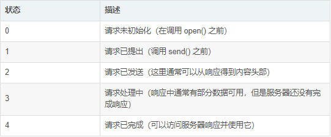

    - 向这个onreadystatechange函数中添加一个判断语句,测试响应是否成功

      ```js
    xhr.onreadystatechange=function(){
            // 可以在这里做些操作
            if(xhr.readyState===4){
                // 从服务的response获得数据
            }
        }
      ```
    
  - responseText

    - 可以通过responseText属性来获取服务器返回的数据

      ```js
    xhr.onreadystatechange=function(){
          // 可以在这里做些操作
          if(xhr.readyState===4){
              // 从服务的response获得数据
              document.myForm.time.value= xhr.reponseText
          }
      }
      ```
  
  - 其它属性

    ​	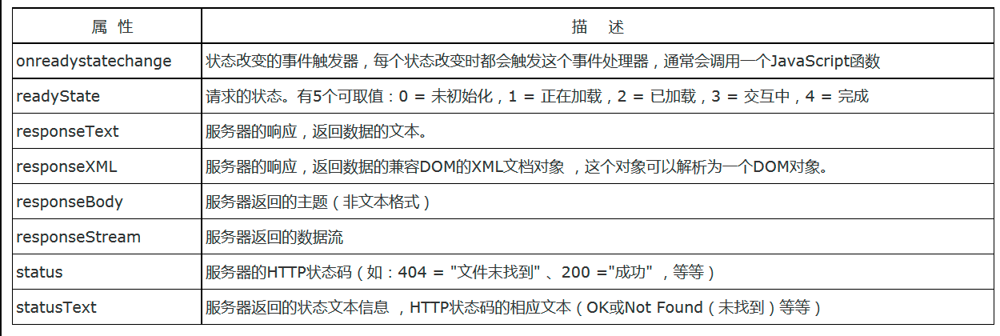

- **常用方法:**

  - open()方法

    - open()有三个参数,`第一个参数定义发送请求使用的方法`第二个参数`规定服务器端脚本的URL,`,第三个参数`规定应对当前请求进行异步处理`

    ```js
    xhr.opne('GET',test.php,true) // ture代表异步
    ```

  - send()方法

    - send()方法将请求发送服务器,假设HTML文件,和PHP文件位于相同目录,那么代码是以下形式

    ```js
    xhr.send(null)
    ```

  - 其它方法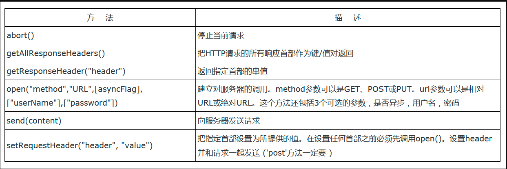

- **发送一个ajax-get请求**

  - 创建XMLHttpRequest对象
  - 设置请求方式
  - 调用回调函数
  - 发送请求

  ```js
  // 1- 创建对象
  let xhr =new  XMLHttpRequest()
  var url = `http://location:8080/ajaxGet/login`
  // 2- 设置请求参数
  xhr.opne('GET',url,true)
  // 3- 发送请求
  xhr.send()
  // 4- 注册事件
  xhr.onreadystatechange=function(){
      if(xhr.readyState===4 && xhr.status===200){ 
              var obj = document.getElementById('id')
              obj.innerHTML= xml.responseText 
      } else{
              alert('ajax服务器返回错误')
          }
  }
  ```
  
- **发送一个ajax-post请求**

  - 发送post请求,需要添加上请求头,否则会报错

  ```js
  // 1- 创建对象
  let xhr =new  XMLHttpRequest()
  var url = `http://location:8080/ajaxGet/login`
  //2- post请求一定要添加请求头才行不然会报错
  xhr.setRequestHeader("Content-type","application/x-www-form-urlencoded");
  // 3- 设置请求参数
  xhr.open('PSOT',url,true)
  // 4- 发送请求
  xhr.send()
  // 5- 注册事件
  xhr.onreadystatechange=function(){
      if(xhr.readyState===4 && xhr.status === 200){
              // 响应成功,做些什么
              var obj = document.getElementById('id')
              obj.innerHTML= xml.responseText 
      }  else{
              alert('ajax服务器返回错误')
          }
  }
  
  ```


### **2、Get和post请求方式的区别有哪些**

- 用处
  - get常用于获取,post用于提交数据
- 安全性
  - get比post`相对安全`
  - get直接把参数暴露在Url地址栏后,post是把请求参数放到请求体中,get参数直接暴露,浏览器会缓存,如果把密码和用户名缓存,那么就会造成泄漏,导致不安全
- 请求参数
  - querystring是url的一部分,get,post都可以带上,get的querystring(仅支持urlencode编码),post参数,是放在Body(支持多种编码)
- 请求参数长度限制
  - get请求长度最多1024kb,post请求对数据没有限制
  - 在http规范中,并没有对get请求方式进行大小限制,但是浏览器不同,对url长度有限制,对于Post理论上不受限制的
- TCP数据包
  - get请求会产生一个TCP数据包,post请求会产生两个TCP数据包

### **3、请解释一下 JavaScript 的同源策略**

- **含义**

  - 同源策略指的是,一下三者必须要统一,一者不同,就产生跨域

    - 域名
    - 协议
    - 端口

       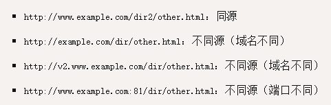

- **目的**

  - 同源策略,为了保证用户信息安全,防止恶意网站窃取数据,假设用户在A网站登录,然后去其它网站浏览,但是B网站,可以获取A网站的cookie,那么此时就会造成用户信息泄露
  
- **限制**

  - cookie,LocalStorage和indexDB无法获取
  - DOM无法获得
  - Ajax请求不能发送

- **规避限制**

  - cookie
    - cookie是服务器写入浏览器的一段信息,只有同源的网页才能共享,但是两个网页一级域名相同,只是二级域名不同,浏览器允许设置`document.domain`共享cookie信息
    - 两个网页不同源: 无法获取对方的DOM,使用`Iframe`和`window.opne`方法打开窗口
  - LocalStorage
    - 通过postMessage()方法,允许跨窗口通信,无论是否两个是不是同源,该方法两个参数,参数1具体信息内容,参数2接收窗口的源(协议+域名+端口)也可以设置为* 表示不受限制,向所有窗口发送
  - ajax
    - jsonp
    - cors

### **4、解决跨域的方式有哪些**

- **jsonp**
  
  - 基本定义
  
    - 通过添加一个script元素,向服务器请求json数据,这种做法不受同源策略限制,利用的是script中的src属性,服务器收到请求以后,将数据放到一个指定名字的回调函数中,传递回来
  
  - 具体实现
  
    ```js
    var script = document.createElement('script');
    script.setAttribute("type","text/javascript");
    script.src = src;
    document.body.appendChild(script);
    }
    window.onload = function () {
      addScriptTag('http://example.com/ip?callback=foo');
    }
    
    function foo(data) {
      console.log('Your public IP address is: ' + data.ip);
        
     //=============________服务器端代码
    // 服务器收到请求后,会把数据放到这个函数的参数位置上    
    foo({
      "ip": "8.8.8.8"
    });
    
    ```
  
- 缺点
  
    - 只能发送Get的请求方式,无法处理Post请求方式
    - 只支持跨域HTTP请求的清空,不能解决不同域的两个页面之间进行js调用的问题
    - jsonp在调用失败的时候,不会返回http状态码
    - 存在一定的安全漏洞
  
- **Cors**

  - 基本定义

    - Cors是一个wc3认定的一个标准,跨域资源共享（Cross-origin resource sharing）解决了ajax只能同源使用的限制
    - 目前浏览器和服务器都支持该种方式,浏览器版本不能低于IE10

  - 实现方式(Cors分为简单请求和复杂请求)

    - **简单请求方式,只要满足一下两大条件就可以**
    
      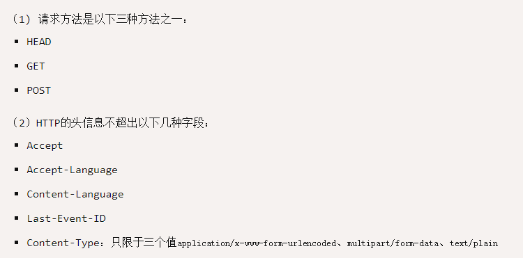
    
    - 简单请求,只需要添加一个`origin`字段即可,浏览器发现是一个简单请求,就自动会在请求头中添加一个`origin`字段
    
      ```js
      GET /cors HTTP/1.1
      // origin字段用来说明,本次请求,来自哪个源(协议+域名+端口) 服务器根据这个值,决定是否同意这次请求
      Origin: http://api.bob.com
      Host: api.alice.com
      Accept-Language: en-US
      Connection: keep-alive
      User-Agent: Mozilla/5.0...
      ```
    
    - 如果`origin`指定的源,不在许可范围内,服务器会返回一个正常的HTTP回应,浏览器发现这个回应头信息没有包含`Access-Control-Allow-Origin`字段,会抛出一个错误,被`XMLHttpRequest`的`onerror`回调函数捕获,这种错误,是无法通过状态码识别的,如果`Origin`指定的域名在许可范围内,服务器会返回响应,多出几个头信息字段
    
      ```js
      Access-Control-Allow-Origin: http://api.bob.com
      Access-Control-Allow-Credentials: true
      Access-Control-Expose-Headers: FooBar
      Content-Type: text/html; charset=utf-8
      // 该请求头中,有三个与Cors请求相关的字段,都按照Access-Contronl开头
      ```
    
    - Access-Contronl-Allow-Origin
    
      - 该字段是必须的,它的值要么是请求时`origin`字段,要么是一个`*`,表示接受任意域名的请求,如果发送cookie,`Access-Contronl-Allow-Origin`不能设置为星号,必须指定明确的,与请求网页一致的域名,同时cookie依然遵循同源政策,只有服务器域名设置的cookie才会上传,其它域名的cookie并不会上传,且(跨域)原网页代码中的`document.cookie`也无法读取服务器域名下的cookie信息
    
    - Access-Control-Allow-Credentials
    
      - 该字段是一个可选字段,表示是否允许发送Cookie,默认情况下,Cookir不包含在Cors的请求之中,true代表服务器明确许可,Cookie可以包含在请求中,是一个单选项,如果不设置true,那么删除该字段即可
    
    - Access-Control-Ecpose-Headers
    
      - 该字段可选。CORS请求时，`XMLHttpRequest`对象的`getResponseHeader()`方法只能拿到6个基本字段：`Cache-Control`、`Content-Language`、`Content-Type`、`Expires`、`Last-Modified`、`Pragma`。如果想拿到其他字段，就必须在`Access-Control-Expose-Headers`里面指定。上面的例子指定，`getResponseHeader('FooBar')`可以返回`FooBar`字段的值
    
    - withCredentials属性
    
      - Cors默认是不会发送Cookie信息,和http认证信息,如果要报Cookie发送到服务器,一方面要服务器统一,指定`Access-Control-Allow-Credentials`字段
    
        ```js
        Access-Control-Allow-Credentials: true
        ```
    
      - 另一方面,开发者必须在Ajax请求中打开`withCredentials`属性,否则即使服务器统一发送cookie,浏览器也不会进行发送,如何省略`withCredentials`字段,有的浏览器还是会发送cookie信息,这个时候,可以显示的关闭`xhr.withCredentials = false;`
    
        ```js
        var xhr = new XMLHttpRequest()
        xhr.withCredentials= true
        ```
    
    - **非简单请求**
    
      - 非简单请求是那种对服务器有特殊要求的请求，比如请求方法是`PUT`或`DELETE`，或者`Content-Type`字段的类型是`application/json`,非简单请求的CORS请求，会在正式通信之前，增加一次HTTP查询请求，称为"预检"请求（preflight）,浏览器先询问服务器，当前网页所在的域名是否在服务器的许可名单之中，以及可以使用哪些HTTP动词和头信息字段,只有得到肯定答复，浏览器才会发出正式的`XMLHttpRequest`请求，否则就报错
    
        ```js
        var url = 'http://api.alice.com/cors';
        var xhr = new XMLHttpRequest();
        xhr.open('PUT', url, true);
        xhr.setRequestHeader('X-Custom-Header', 'value');
        xhr.send();
        ```
    
      - 上面代码中,HTTP的请求方式,是一个PUT,并且发送一个自定义头信息X-Custom-Header,就自动发出一个"预检"请求，要求服务器确认可以这样请求。下面是这个"预检"请求的HTTP头信息
    
        ```js
        OPTIONS /cors HTTP/1.1
        Origin: http://api.bob.com
        Access-Control-Request-Method: PUT
        Access-Control-Request-Headers: X-Custom-Header
        Host: api.alice.com
        Accept-Language: en-US
        Connection: keep-alive
        User-Agent: Mozilla/5.0...
        ```
    
      - "预检"请求用的请求方法是`OPTIONS`，表示这个请求是用来询问的。头信息里面，关键字段是`Origin`，表示请求来自哪个源,除了`Origin`字段,"预检"请求头中的信息包含两个特殊的字段
    
      - Access-Control-Request-Method
    
        - 该字段是必须的，用来列出浏览器的CORS请求会用到哪些HTTP方法，上例是`PUT`。
    
      - Access-Control-Request-Headers
    
        - 该字段是一个逗号分隔的字符串，指定浏览器CORS请求会额外发送的头信息字段，上例是`X-Custom-Header`
    
      - 服务器通过了预检请求,每个浏览器都正常的CORS请求,就跟每个简单的请求一样,会产生一个`Origin`字段,服务器也会回应一个`Access-Control-Allow-Origin`头信息字段
    
        ```js
        // 预检 请求之后,浏览器的正常Cors请求, Origin字段的信息,是自动添加的
        PUT /cors HTTP/1.1
        Origin: http://api.bob.com
        Host: api.alice.com
        X-Custom-Header: value
        Accept-Language: en-US
        Connection: keep-alive
        User-Agent: Mozilla/5.0...
        ```
    
      - 服务器的正常反应('Access-Control-Allow-Origin'该字段每次回应都是必须包含的)
    
        ```js
        Access-Control-Allow-Origin: http://api.bob.com
        Content-Type: text/html; charset=utf-8
        ```
    
        

### **5、什么是同步什么是异步**

- **单线程**

  - JavaScript是一门单线程语言,因此，`JavaScript在同一个时间只能做一件事，单线程意味着，如果在同个时间有多个任务的话，这些任务就需要进行排队，前一个任务执行完，才会执行下一个任务`，因为javaScript是一个单线程执行过程,同时间内处理多个任务,所有任务都会排队,前一个任务执行完毕,下一个任务才会执行,如果上一个任务执行时间很长(比如ajax请求),那么就会造成下一个任务等待,严重影响用户体验,所以才会有`同步任务`和`异步任务`

    ```js
    // 同步代码
    function fun1() {
      console.log(1);
    }
    function fun2() {
      console.log(2);
    }
    fun1();
    fun2();
    // 输出
    1
    2
    // 如果fun1中是一个ajax操作,需要一定的时间,那么我们需要完全等待fun1()执行完毕后,才能执行fun2()吗?
    ```

    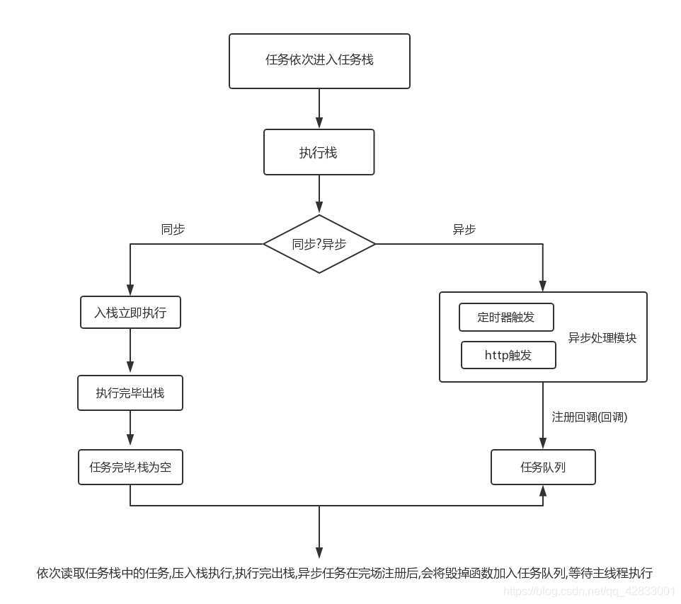

- **同步任务**

  - 同步任务是指,`主线程上排队执行的任务,只有前一个任务执行完毕,才能继续执行下一个任务`,当我们打开网站时,网站的渲染过程,比如元素的渲染,就是一个同步任务

    ```js
    // 同步代码
    var num = 20;
    console.log(num) // 马上输出结果
    
    // 同步代码
    var arr = [12,3224,34]
    for(var i =0; i<arr.length;i++){
        console.log(arr[i])
    }
    // 同步代码.........还有非常多,除了callback() ajax和setTimeout以及Proimse中的.then()方法,都可以视为同步代码
    ```

- **异步任务**

  - 异步任务是指, `不进入主线程,而是进入任务队列的任务,只有任务队列通知主线程,某个异步任务可以执行了,该任务才会进入主线程`,当我们打开网站时,例如图片的加载,音乐的加载,就是一个异步任务

    ```js
    function fun1() {
      console.log(1);
    }
    function fun2() {
      console.log(2);
    }
    function fun3() {
      console.log(3);
    }
    fun1();
    setTimeout(function(){
      fun2();
    },0);
    fun3();
     
    // 输出
    1
    3
    2
    ```

  - 异步机制实现原理(EventLoop是一码事)

    - javaScript中的异步如何实现的,需要知道`回调和事件循环`,异步任务是不会进入主线程中,会先进入到`异步任务队列`,任务队列其实就是一个遵循`先进后出,后进先出`的数据结构,也是一个事件队列,例如文件读取操作,是一个异步任务,该任务会先被添加到`异步任务队列中`,等到IO完成,就会在任务队列中,`添加一个事件`,表示异步任务已经完毕,可以进入执行栈了,但是此时,主线程未必有空处理,当主线程处理完其它任务后,才会读取`异步任务队列`中的代码,单线程从任务队列中获取任务,这个过程是不断循环的,每次执行栈清空以后,都会在`任务队列`中读取,如果没有任务,等到有新任务,如果存在任务,那么就会拿出来进行执行,这个循环的过程,就叫`事件循环`
    - 总结来说
      - 所有同步任务都在主线程上执行，行成一个执行栈
      - 主线程之外，还存在一个任务队列，只要异步任务有了结果，就会在任务队列中放置一个事件
      - 一旦执行栈中所有异步任务执行完毕,系统就会读取任务队列,查看是否还存在异步任务,结束等待状态,进入执行栈,开始执行
      - 主线程不断重复以上三步

### **6、什么是HTTP协议  HTTP和HTTPS的区别（拓展需要掌握）**

- **什么是HTTP协议**
  - 超文本传输协议（英文：**H**yper**T**ext **T**ransfer **P**rotocol，缩写：HTTP）是一种用于分布式、协作式和超媒体信息系统的应用层协议。HTTP是万维网的数据通信的基础
  - HHTTP是一个客户端终端（用户）和服务器端（网站）请求和应答的标准（TCP）。通过使用网页浏览器、网络爬虫或者其它的工具，客户端发起一个HTTP请求到服务器上指定端口（默认端口为80)我们称这个客户端为用户代理程序（user agent）。应答的服务器上存储着一些资源，比如HTML文件和图像。我们称这个应答服务器为源服务器（origin server）。在用户代理和源服务器中间可能存在多个“中间层”，比如代理服务器、网关或者隧道（tunnel）
  - HTTP客户端发起一个请求，创建一个到服务器指定端口（默认是80端口）的TCP连接。HTTP服务器则在那个端口监听客户端的请求。一旦收到请求，服务器会向客户端返回一个状态，比如"HTTP/1.1 200 OK"，以及返回的内容，如请求的文件、错误消息、或者其它信息
- **HTTP和HTTPS的区别**
  - HTTP协议传输的数据都是未加密的,明文显示,因为使用HTTP传输的隐私信息,非常的不安全,为了保证信息能够加密进行传输,所以在HTTP基础上设计了SSL(Secure Sokets Layer)协议用于HTTP协议传输的数据进行加密处理,从而就诞生了HTTPS
  - HTTPS协议是有SSL+HTTP协议构建的可进行加密传输,身份认证的网络协议,比HTTP协议要安全
  - 区别如下
    - HTTPS协议需要到CA申请证书,一般免费证书较少,需要一定费用
    - HTTP是超文本传输协议,信息是明文显示,但是HTTPS具有安全性的SSL协议加密传输
    - HTTP和HTTPS使用完全不同的连接方式,默认端口也不一样,前者是80后者是443
    - HTTP的连接也很简单,是无状态的,HHTPS协议是有SSL+HTTP协议构建可进行加密传输,以身份认证的网络协议,比HTTP协议,更加安全

### **7、常见的HTTP状态码有哪些，分别代表什么含义**

- **状态码种类**

  - 1xx：指示信息--表示请求已接收，继续处理
  - 2xx：成功--表示请求已被成功接收、理解、接受
  - 3xx：重定向--要完成请求必须进行更进一步的操作
  - 4xx：客户端错误--请求有语法错误或请求无法实现
  - 5xx：服务器端错误--服务器未能实现合法的请求

- **常见状态码及含义**

     ```tex
  200 OK                        	//客户端请求成功
  400 Bad Request             //客户端请求有语法错误，不能被服务器所理解
  401 Unauthorized            //请求未经授权，这个状态代码必须和WWW-Authenticate报头域一起使用 
  403 Forbidden                 //服务器收到请求，但是拒绝提供服务
  404 Not Found                //请求资源不存在，eg：输入了错误的URL
  500 Internal Server Error  //服务器发生不可预期的错误
  503 Server Unavailable     //服务器当前不能处理客户端的请求，一段时间后可能恢复正常
  ```

### [**8、什么是TCP连接的三次握手（拓展需要掌握）**](https://blog.csdn.net/weixin_44262932/article/details/112786892)

- 第一次握手：建立连接时，客户端发送syn包（syn=j）到服务器，并进入SYN_SENT状态，等待服务器确认；SYN：同步序列编号（Synchronize Sequence Numbers)
- 第二次握手：服务器收到syn包，必须确认客户的SYN（ack=j+1），同时自己也发送一个SYN包（syn=k），即SYN+ACK包，此时服务器进入SYN_RECV状态
- 第三次握手：客户端收到服务器的SYN+ACK包，向服务器发送确认包ACK(ack=k+1），此包发送完毕，客户端和服务器进入ESTABLISHED（TCP连接成功）状态，完成三次握手

## ES6

### 1、Array拓展

- 扩展运算符
- Arrar.from()
- Arrar.of()
- 实例copyWithin()
- 实例find()和findIndex()
- 实例fill()
- 实例entrens()keys()values()
- 实例inculecs()
- 实例flat(),flatMap()

### 2、String拓展&方法

- for of遍历

  - 可以使用下方的语法,进行遍历,同时,for of 可以遍历`oxFFF`的码点

    ```js
    for (let codeString of  'foo'){
        console.log(codeString)
    }
    // "f"
    // "o"
    // "o"
    ```

- 模板字符串(template string)

  - 是一种增强版本的字符串,使用反引号(` )进行标识,可以当做普通的字符串使用,也可以定义多个字符串,同时也可以在字符串中嵌入变量

    ```js
    $('#result').append(`
      There are <b>${basket.count}</b> items
       in your basket, <em>${basket.onSale}</em>
      are on sale!
    `);
    ```

- includes()

  - 返回一个布尔值,表示是否找到了参数字符串

    ```js
    let s = 'Hello world!';
    s.includes('o') // true
    // 第二个参数,代表查询起始位置
    s.includes('o',6) // false
    
    ```

- startsWith()

  - 返回布尔值,表示参数字符串是否在原字符串头部

    ```js
    let s = 'Hello Word!';
    s.startsWith('Hello') // true
    // 第二个参数,代表查询起始位置
    s.endsWith('Hello', 5) // true
    ```

- endsWith()

  - 返回布尔值,表示参数字符串是否在原字符串的尾部

    ```js
    let s = 'Hello world!';
    // 第二个参数,针对前n个参数,其它两个方法,针对的是从第n个位置知道字符结束
    s.startsWith('world', 6) // true
    s.endsWith('Hello', 5) // true
    ```

- repeat()

  - 返回新的字符串,表示将原字符串重复多少次

    ```js
    'x'.repeat(3) // "xxx"
    'hello'.repeat(2)// "hellohello"
    
    // 参数如果是小数,会被取整
    'na'.repeat(2.9) // "nana"
    
    // 如果repeat的参数是负数,或lfinity,会报错
    'na'.repeat(Infinity)
    // RangeError
    'na'.repeat(-1)
    // RangeError
    
    // 但是，如果参数是 0 到-1 之间的小数，则等同于 0，这是因为会先进行取整运算。0 到-1 之间的小数，取整以后等于-0，repeat视同为 0
    'na'.repeat(-0.9) // ""
    
    // 参数是NaN等于与0
    'na'.repeat(NaN) // ""
    
    // 如果repeat的参数是字符串，则会先转换成数字
    'na'.repeat('na') // ""
    'na'.repeat('3') // "nanana"
    ```

### 3、Obejct拓展&方法

- 属性和方法简写

  - 属性简写

    ```js
    let obj = 'is object';
    let objName = {obj}
    objName // {obj:'is object'}
    
    // 等价于
    const objName = {obj:obj}
    //  ***********************************************分割线*****************************************
    function fn (x,y){
        return {x+y}
    }
    // 等同于
    function fn (x,y){
        return {x:x,y:y}
    }
    fn(1,2) // Object {x:1,x:2}
    ```

  - 方法简写

    ```js
    const Person={
        sayHi(){
            console.log('我是Person对象中的sayHi方法')
        }
    }
    
    // 等价于
    const Person={
        sayHi:function(){
            console.log('我是Person对象中的sayHi方法')
        }
    }
    //  ***********************************************分割线*****************************************
    let url = 'htpps://www.baidu.com'
    const ToUrl ={
        url, 
        erros: (){ console.log('url is errors')}
    }
    
    //等价于
    let url = 'htpps://www.baidu.com'
    const ToUrl ={
         // 等同于: url:url
        url,
        // 等价于:  erros:function() {}
        erros:  (){ console.log('url is errors')} 
    }
    ```

    - 应用场景1(`commonJS中就可以采用这种方式`)

    ```js
    let ms = {};
    
    function getItem (key) {
      return key in ms ? ms[key] : null;
    }
    
    function setItem (key, value) {
      ms[key] = value;
    }
    
    function clear () {
      ms = {};
    }
    
    module.exports = { getItem, setItem, clear };
    // 等同于
    module.exports = {
      getItem: getItem,
      setItem: setItem,
      clear: clear
    };
    ```

  - 应用场景2(`属性赋值器(getter)和属性取值期(setter)也可以采用此种方式`)

    ```js
    const cart = {
      _wheels: 4,
    
      get wheels () {
        return this._wheels;
      },
    
      set wheels (value) {
        if (value < this._wheels) {
          throw new Error('数值太小了！');
        }
        this._wheels = value;
      }
    }
    ```

  - 注意事项(`不能在构造函数中使用简写的方式`)

    ```js
    const obj = {
      f() {
        this.foo = 'bar';
      }
    };
    
    new obj.f() // 报错
    // 因为f简写的是对象的方法,所以foo.f不能当做构造函数使用
    ```

- 属性可枚举型

  - 对象的每个属性都有一个描述对象,用来控制该属性的行为,obj.geyOwnPropertyDescriptor方法,可以获取该属性的描述对象,描述对象的eumerable属性,称为可枚举性,如果该属性为false,就表示某些操作会忽略当前属性

    ```js
    let obj = { foo : 123}
    Object.getOwnPropertyDescriptor(obj, 'foo')
    //  {
    //    value: 123,
    //    writable: true,
    //    enumerable: true,
    //    configurable: true
    //  }
    ```

- 属性的遍历

  - for in
    - `for...in`循环遍历对象自身的和继承的可枚举属性（不含 Symbol 属性）
  - Object.keys
    - `Object.keys`返回一个数组，包括对象自身的（不含继承的）所有可枚举属性（不含 Symbol 属性）的键名
  - Object.getOwnPropertyNames(obj)
    - `Object.getOwnPropertyNames`返回一个数组，包含对象自身的所有属性（不含 Symbol 属性，但是包括不可枚举属性）的键名
  - Object.getOwnPropertySymbols(obj)
    - `Object.getOwnPropertySymbols`返回一个数组，包含对象自身的所有 Symbol 属性的键名
  - Reflect.ownKeys(obj)
    - `Reflect.ownKeys`返回一个数组，包含对象自身的（不含继承的）所有键名，不管键名是 Symbol 或字符串，也不管是否可枚举
  - 注意事项:
    - 以上的 5 种方法遍历对象的键名，都遵守同样的属性遍历的次序规则
    - 首先遍历所有数值键，按照数值升序排列
    - 其次遍历所有字符串键，按照加入时间升序排列
    - 最后遍历所有 Symbol 键，按照加入时间升序排列

- 对象的拓展运算符

  - 对象的拓展运算符,用于取出参数对象的所有可遍历属性,拷贝到当前对象之中

    ```js
    let obj = { a: { b: 1 } };
    let { ...x } = obj;
    obj.a.b = 2;
    x.a.b // 2
    ```

  - 由于数组是特殊的对象,所以对象的拓展运算符,也可以用于数组

    ```js
    let foo = {...['a','b','c']}
    foo
    //  {0: "a", 1: "b", 2: "c"}
    ```

  - 如果拓展运算符后面是一个空对象,那么不会有任何效果

    ```js
    {...{}, a: 1}
    // { a: 1 }
    ```

  - 如果拓展运算符后面不是一个对象,那么会自动转换为对象

    ```js
    // 等同于 {...Object(1)}
    {...1} // {}
    ```

  - 上面代码中,拓展运算符后面都是整数1,会自动转换为数值类型,由于该对象没有该属性,所以最后返回一个空对象

    ```js
    // 等同于 {...Object(true)}
    {...true} // {}
    
    // 等同于 {...Object(undefined)}
    {...undefined} // {}
    
    // 等同于 {...Object(null)}
    {...null} // {}
    ```

  - 如果运算符后面是一个字符串,会自动转换为一个类数组的对象,因此返回的不是一个空对象

    ```js
    {...'hello'}
    // {0: "h", 1: "e", 2: "l", 3: "l", 4: "o"}
    ```

  - 对象的拓展运算符等同于使用`Object.assign()`方法

    ```js
    let aClone = { ...a };
    // 等同于
    let aClone = Object.assign({}, a);
    // 上面只是拷贝了对象实例的属性,如果想完整的克隆一个对象,还拷贝对象的原型属性,可以采用以下方式
    // 写法一
    const clone1 = {
      __proto__: Object.getPrototypeOf(obj),
      ...obj
    };
    
    // 写法二
    const clone2 = Object.assign(
      Object.create(Object.getPrototypeOf(obj)),
      obj
    );
    
    // 写法三
    const clone3 = Object.create(
      Object.getPrototypeOf(obj),
      Object.getOwnPropertyDescriptors(obj)
    )
    ```

### 4、解构赋值

- 对象的解构赋值

  - 对象的解构赋值用于从一个对象取值,相当于将目标对象自身的所有可以遍历,但尚未被读取的属性,分配到指定的对象上面,所有的键和他们的值,都会被拷贝到新对象上面

  - 无法对`undefined`和`null`进行转换,因为这两个无法转换为对象

    ```js
    let { ...z } = null; // 运行时错误
    let { ...z } = undefined; // 运行时错误
    ```

  - 解构赋值必须是最后一个参数，否则会报错

    ```js
     let{ ...x, y, z } = someObject; // 句法错误
    let { x, ...y, ...z } = someObject; // 句法错误
    ```

  - 解构赋值中的拷贝是浅拷贝

    ```js
    let obj = { a: { b: 1 } };
    let { ...x } = obj;
    obj.a.b = 2;
    x.a.b // 2
    ```

### 5、Set和Map数据结构

- set

  - 类似于数组的形式,但是成员都是唯一的,没有重复的值,Set本身是一个构造函数,用来生成Set数据结构

    ```js
    const s = new Set();
    
    [2, 3, 5, 4, 5, 2, 2].forEach(x => s.add(x));
    
    for (let i of s) {
      console.log(i);
    }
    // 2 3 5 4
    ```

  - 可以进行的遍历操作

    - `Set.prototype.keys()`：返回键名的遍历器
    - `Set.prototype.values()`：返回键值的遍历器
    - `Set.prototype.entries()`：返回键值对的遍历器
    - `Set.prototype.forEach()`：使用回调函数遍历每个成员

- map

  - 本质上是键值对的结合(Hash结构),但是传统上只能用字符串当做键,这给其使用方式带来了很大的限制

    ```js
    const data = {};
    const element = document.getElementById('myDiv');
    
    data[element] = 'metadata';
    data['[object HTMLDivElement]'] // "metadata"
    ```

  - 遍历方法

    - Map 结构原生提供三个遍历器生成函数和一个遍历方法
    - `Map.prototype.keys()`：返回键名的遍历器
    - `Map.prototype.values()`：返回键值的遍历器
    - `Map.prototype.entries()`：返回所有成员的遍历器
    - `Map.prototype.forEach()`：遍历 Map 的所有成员

### 6、Async函数

### 7、Proxy

### 8、Promise

### 9、Class继承

## Vue

### 1、MVVM模式

- **基本定义**

  - MVVM是Model-View-ViewModel的缩写,MVVM是一种设计思想,Model 层代表数据模型，也可以在Model中定义数据修改和操作的业务逻辑；View 代表UI 组件，它负责将数据模型转化成UI 展现出来，ViewModel 是一个同步View 和 Model的对象,在MVVM架构下，View 和 Model 之间并没有直接的联系，而是通过ViewModel进行交互，Model 和ViewModel 之间的交互是双向的， 因此View 数据的变化会同步到Model中，而Model 数据的变化也会立即反应到View 上,ViewModel 通过双向数据绑定把 View 层和 Model 层连接了起来，而View 和 Model 之间的同步工作完全是自动的，无需人为干涉，因此开发者只需关注业务逻辑，不需要手动操作DOM, 不需要关注数据状态的同步问题，复杂的数据状态维护完全由 MVVM 来统一管理

- **图解**

   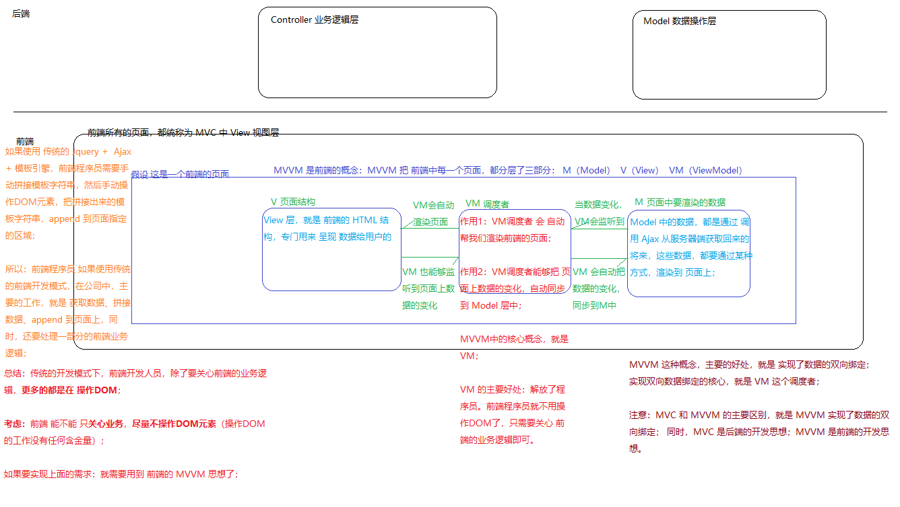

### 2、Vue双向绑定的原理

- **基本定义**
  - 在Vue2版本中,双向绑定的原理,采用的是,`数据劫持结合发布者,订阅者模式`实现的,通过`Object.definePropety()`来劫持各个属性的setter,和getter,在数据发生变动的时,发布消息给订阅者,触发相应监听回调,把一个普通的javaScript对象传给Vue实例,作为它的data选项,Vue将遍历所有的属性,利用Object.definePropetype把它们转换为getter/setter,用户看到不到getter/setter,但是在内部使用Vue追踪依赖,在属性被访问和修改时,通知发生变化
  - Vue将MVVM作为数据绑定的入口,整合Observer,Compile和Watch三者,通过Observer来监听自己的model数据变化,通过Compile来解析编译模板指令,最用它利用Watcher大气observer和Compile之间的通讯桥梁,达到数据变化,->视图更新,视图交互变化->数据Model变更双向绑定的结果
  
- **代码实现**

  ```html
  <body>
    <!-- <script src="https://cdn.jsdelivr.net/npm/vue"></script> -->
    <div id="app"></div>
    <input id="txt"></input>
    <p id="show"></p>
    <script>
      var obj= {}
      // 1- 监听空对象obj,和input输入框
      Object.defineProperty(obj,'txt',{
        // 2- get属性获取外部obj对象
        get:function(){
          return obj
        },
        // 3- set改写,并且把文本,和视图,进行关联
        set:function(newValue){
          document.getElementById('txt').value= newValue
          document.getElementById('show').innerHTML=newValue
        }
      })
      // 4- 监听keyup事件,实现数据同时显示和更新
      document.addEventListener('keyup',function(e){
        obj.txt=e.target.value
      })
    </script>
  </body>
  ```

### 3、生命周期函数

- **基本定义**

  - 生命周期函数,可以为`创建期间`和`运行期间`以及`销毁期间`

    - 创建期间
      - beforeCreate,created,beforeMount,mounted
    - 运行期间
      - beforeUpdate,updated
    - 销毁期间
      - beforeDestroy,destroyed

    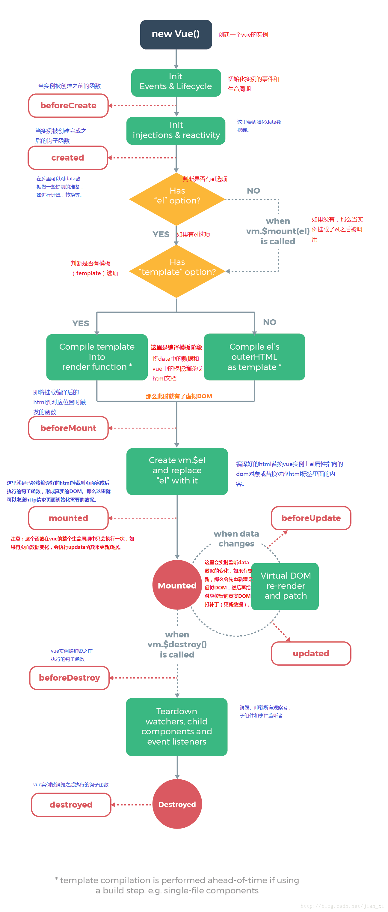

- **详细说明**

  - `1- 创建期间`
    - beforeCreate
      - Vue或者组件刚刚实例化,data和methods还没有被创建
    - created
      - 此时data和methods已经被创建,可以使用,但还没有开始编译,如果首屏的ajax请求,可以放到这个钩子中执行
    - beforeMount
      - created的下一个阶段,此时模板已经被编译,但是还没有挂载到网页中
    - mounted
      - 模板代码已经加载到了网页中,但此时创建期间所有的事情都已经准备好了,网页开始运行
  - `2- 运行期间`
    - beforeUpdate
      - 在网页运行期间,data中的数据可能会更新,在这个阶段,数据只是在data中进行更新了,但是没有在模板中进行更新,因此网页显示的还是之前的
    - update
      - 数据在data中更新了,此时页面上的数据都是最新的
  - `3-销毁期间`
    - beforeDestroy
      - Vue实例或者是组件在销毁之前执行的函数,在这一个函数中Vue或者组件中的所有属性,都是可用的
    - destroyed
      - Vue实例或者组件被销毁后执行的,此时Vue实例上所有的东西都会解绑,所有的时间都会被移除,所有子元素都会被销毁

### 4、指令系列

- **4-1 常见指令**

  - v-model

    - 用于表单元素的绑定,箭筒用户输出事件的以及更新数据

  - v-text

    - 更新元素的extContent,将数据解析为纯文本

  - v-on

    - 绑定事件
    - 语法`v-on:click="say" or v-on:click="say('参数', $event)`
    - 简写: `@click='say'`
    - 使用逗号分隔绑定多个事件`<div v-on="click:onClick, keyup:onKeyup, keydown:onKeydown"></div>`

  - v-for

    - 根据数据多次渲染元素或模板

      ```vue
      遍历数组 item 为当前项，index 为索引
      <p v-for="(item, index) in list">{{item}} -- {{index}}</p>
      遍历对象 item 为值，key 为键，index 为索引
      <p v-for="(item, key, index) in obj">{{item}} -- {{key}}</p>
      遍历常量 item为从1开始的递增值
      <p v-for="item in 10">{{item}}</p>
      ```

  - v-bind

    - 绑定属性
    - 语法:`v-bind:title='msg'`
    - 简写:`:title='msg'`

  - v-html

    - 更新元素的innerHTML,把数据解析为纯文本显示

  - v-if/v-else/v-else-if

    - 根据表达式值的真假条件,销毁或重建元素v-if,适合条件不大可能的改变的场景,v-if-else和v-else不用脱离v-if单独存在

  - v-show

    - 根据表达式真假结果,切换元素的diplay css属性,dom元素一直在v-show适合频繁切换

  - v-once

    - 只渲染元素组件一次,随后重新进行渲染,元素/组件以及其所有子节点,都被视为静态内容跳过,可以优化更新性能

  - v-pre

    - 主要应用与跳过这个元素和子元素编译过程,可以用来显示原始标签,跳过大量没有指令的节点,加快编译

- **4-2 自定义指令**

- **4-3 指令面试题**

### 5、组件系列

- **5-1 组件的基本定义**
- **5-2 父子组件传值**
- **5-3 子父组件传值**
- **5-4 兄弟组件传值**
- **5-5 爷孙组件传值**
- **5-6 组件中的data为什么必须是一个函数?**
- **5-7 组件中插槽的作用**
- **5-8 如何实现组件缓存?**

### 6、Watch和Computed以及Methods的应用以及加载顺序

### 7、Vue-Router系列

- **7-1 Vue-Router实现的原理**
- **7-2 如何配置动态路由**
- **7-3 如何实现动态传参**
- **7-4 Vue-Router中存在哪些钩子函数**
- **7-5 路由跳转的方式**
- **7-6 嵌套路由的实现**
- **7-7  `$route`和` $router`的区别**
- 

### 8、Vuex系列

- **8-1 你所理解的Vuex**
- **8-2 介绍一下Vuex中的核心属性**

### 9、Vue-Cli系列

- 9-1 **目录中文件职责**

### 10、webpack系列

- **10-1 webpack概述**

- **10-2 webpack如何实现热更新**
